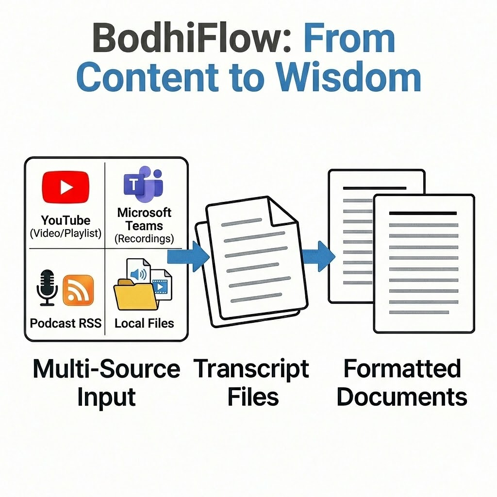
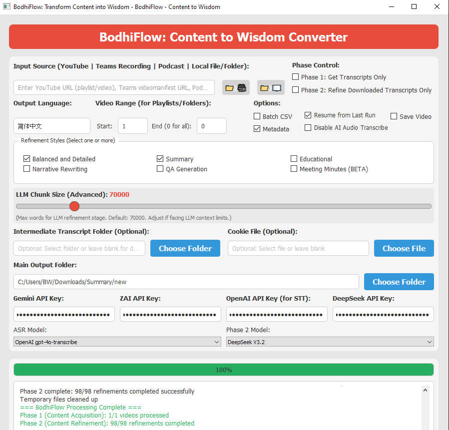

# BodhiFlow: Content to Wisdom Converter

Turn videos, meetings, podcasts, and documents (PDF, Word, PowerPoint, Excel, EPUB, Markdown, etc.) into structured Markdown you can search, share, and reuse.

---

## Why BodhiFlow?

Content is everywhere -- in video, audio, and documents. BodhiFlow extracts the text (from captions, from documents via MarkItDown, or by transcribing with AI when there are no captions), then shapes it into the form you need -- summary, study guide, Q&A, meeting minutes, or narrative. Point it at a link or folder, pick your styles, and run.

### Who it's for


| You are...                                 | You get...                                                                                       |
| ------------------------------------------ | ------------------------------------------------------------------------------------------------ |
| **Learner** studying a YouTube course      | One document per video in your language: Summary, Educational outline, Q&A -- whatever you pick. |
| **Knowledge worker** with Teams recordings | Transcript + meeting-minutes summary, ready to archive or share.                                 |
| **Team lead** with a backlog of meetings   | Batch-process a folder of recordings into consistent minutes.                                    |
| **Content curator** repurposing podcasts   | One document per episode (summary, narrative, or Q&A) with clean metadata.                       |
| **Researcher** with PDFs or Word files     | Extracted text refined into Summary, Educational, or Q&A; one output per source file.            |

<br>
<table>
  <tr>
    <td></td>
    <td></td>
  </tr>
</table>
<br>
---

## Features

### Document styles

Pick one or more per run; each produces a separate output file.


| Style                         | What it does                                               |
| ----------------------------- | ---------------------------------------------------------- |
| ⚖️ **Balanced and Detailed**  | Keeps every detail; adds headings, bullets, and emphasis.  |
| 📝 **Summary**                | Main message, arguments, and key takeaways only.           |
| 📚 **Educational**            | Textbook-style: headings, subheadings, key terms defined.  |
| ✍️ **Narrative Rewriting**    | Readable story form, faithful to the original.             |
| ❓ **Q&A Generation**          | Questions with foldable answers -- great for study guides. |
| 🤝 **Meeting Minutes** (beta) | Action items and decisions from meeting recordings.        |


Styles live in `prompts.py` and can be customized.

### Supported sources

**Video and audio**

- YouTube video or playlist
- Microsoft Teams meeting recording (videomanifest URL)
- Podcast RSS feed
- Local video/audio file or folder

**Documents (text extracted via MarkItDown, then refined like transcripts)**

- **Supported formats:** PDF, Word (.doc/.docx), PowerPoint (.pptx), Excel (.xlsx/.xls), EPUB, Outlook (.msg), Markdown (.md/.markdown), HTML, plain text (.txt), CSV, JSON, XML (all formats supported by [MarkItDown](https://pypi.org/project/markitdown/) with `markitdown[all]`).
- Local file or folder of documents; optional recursive subfolders.
- Webpage URL (content fetched and converted to text).

For member-only or age-restricted YouTube, provide a cookie file (Netscape format, exported from your browser).

### How the two steps work


|            | What happens                                                                                                                                                                                 | You can skip it?                                                            |
| ---------- | -------------------------------------------------------------------------------------------------------------------------------------------------------------------------------------------- | --------------------------------------------------------------------------- |
| **Step 1** | **Video/audio:** Gets captions, or downloads audio and transcribes via AI (OpenAI or ZAI). **Documents (PDF, Word, PPTX, Excel, EPUB, Outlook .msg, Markdown, HTML, CSV, etc.):** Extracts text with MarkItDown (no speech-to-text). | Yes -- use "Phase 2 only" to refine existing transcripts or extracted text. |
| **Step 2** | Sends the text to an LLM (Gemini, ZAI, DeepSeek, or OpenAI) with your chosen style(s) and language.                                                                                          | Yes -- use "Phase 1 only" to collect transcripts/text without refining.     |


You only need an API key for the provider(s) you actually use.

### More options

- **Output language** -- e.g. English, Simplified Chinese; the refined text will be in that language.
- **Batch CSV** -- list many inputs in a spreadsheet: columns `input` (required), `styles`, `language`, `output_subdir` (optional). Save as UTF-8. One row per job.
- **Resume** -- skip items already processed; only retry failed or new ones.
- **Video range** -- for playlists/folders, process items from position X to Y.
- **Disable AI Transcribe** -- for YouTube only: use existing captions only; no audio download or AI transcription fallback (saves cost when captions are usually available).
- **Save source media** -- optionally keep the downloaded audio/video for your records.
- **Metadata enhancement** -- optionally use AI to fill in missing descriptions and tags.
- **Chunk size** (advanced) -- controls how much text is sent to the LLM per call (default works for most users).
- **Model configuration** -- add or swap AI models by editing `config/models_config.json`; no code change needed.
- **ZAI model constraints** -- ZAI ASR (GLM-ASR-2512) requires audio chunks ≤30s and ≤25MB; the config uses `max_chunk_duration_seconds: 30` so the app automatically slices audio to meet this. ZAI Phase 2 (e.g. GLM-4.7-Flash) uses `max_concurrency: 1` in config to avoid rate limits and stuck tasks; refinement runs one request at a time when this model is selected.
- **URL source whitelist** -- `config/url_source_config.json` defines which URL types and domains are accepted (e.g. webpage text extraction). Each entry has `id`, `label`, `domain_patterns` (e.g. `["*"]` for any domain, or `["example.com"]` to allow only that host), and `implemented`. The first matching entry wins; if no match, the URL is rejected with a hint to add the domain. Use this to restrict which websites can be used as input or to add new URL source types.

---

## Getting started

### Requirements

- Python 3.10+ (3.13 works)
- FFmpeg on your system PATH
- At least one API key: Gemini, ZAI, DeepSeek, or OpenAI (depending on which model you choose for transcription and refinement)

### Installation

From the BodhiFlow project folder:

```bash
uv pip install -U -r requirements.txt   # or: pip install -U -r requirements.txt
```

Optionally copy `.env.example` to `.env` and set your API keys (and optionally `LANGUAGE`) so the app pre-fills them.

### How to run

1. **Obtain API Keys**: 
 - * For the audio transcription feature, get an OpenAI API key from ++[OpenAI Platform](https://platform.openai.com/)++ or ZAI key from ++[Z.AI Platform](https://z.ai/manage-apikey/apikey-list)++
 - * For text refinement, get an API Key from ++[Google AI Studio](https://ai.google.dev/gemini-api/docs/api-key)++, ++[OpenAI Platform](https://platform.openai.com/)++, ++[Z.AI Platform](https://z.ai/manage-apikey/apikey-list)++, or ++[DeepSeek Platform](https://platform.deepseek.com/api_keys)++,
2. **One-time setup:** Set the default program for `.pyw` files to **pythonw** (e.g. Right-click `main.pyw` → Open with → Choose another app → pythonw.exe → check "Always use this app"). After that, double-clicking `main.pyw` will start BodhiFlow without a console window.
3. **Shortcut:** Create a shortcut (`.lnk`) to `main.pyw` and place it on the desktop, taskbar, or any folder. Open Properties and set the "Target" path to "{YOUR_PATH_TO}\BodhiFlow\main.pyw" and "Start in" path to "{YOUR_PATH_TO}\BodhiFlow" and Change Icon path to "{YOUR_PATH_TO}\BodhiFlow\BodhiFlow.ico". You can then launch BodhiFlow from anywhere with one click like a normal software.

### Usage

1. Double-click `main.pyw` (or your shortcut).
2. Paste a source URL or local path (or enable **Batch CSV** and select a CSV file to process multiple sources).
3. Choose output language, document style(s), and any options you need.
4. Enter the API key(s) for the provider(s) you selected. (You can maintain in .env in advance)
5. Set the **Main Output Folder** (optional: Intermediate Transcript Folder, default `{output}/intermediate_transcripts/`; Cookie File for YouTube).
6. Click **Start Processing** (or **Cancel** to stop after the current item).

Tips: Hover over any control for a tooltip. 
Output: one Markdown file per (source x style) in your output folder.

---

## Project structure

```
BodhiFlow/
|-- main.pyw                   # Entry point (run this)
|-- flow.py                    # PocketFlow Flow: the workflow pipeline definition — which nodes run, in what order, and how data is passed
|-- nodes.py                   # PocketFlow Nodes: what task is being processed at each node in the workflow
|-- prompts.py                 # Refinement style prompts (editable)
|-- config/
|   |-- models_config.json     # AI model list (editable)
|   |-- url_source_config.json # URL whitelist (editable)
|-- gui/
|   |-- main_window.py        # Main window, controls, tooltips
|   |-- styles.qss            # Qt stylesheet
|-- utils/
|   |-- input_handler.py      # Input type detection, URL whitelist lookup
|   |-- acquisition_processor.py  # Phase 1: video/audio/document acquisition (unified)
|   |-- speech_to_text.py     # ASR (OpenAI, ZAI)
|   |-- text_extractor.py     # Document text extraction (MarkItDown[all]: PDF, Word, PPTX, Excel, EPUB, .msg, etc.)
|   |-- call_llm.py           # Multi-provider LLM (Gemini, ZAI, DeepSeek, OpenAI)
|   |-- llm_refiner.py        # Phase 2 refinement + metadata wiring
|   |-- metadata.py           # YAML front matter; meta_infer.py = optional AI metadata enhancement
|   |-- csv_batch.py          # Batch CSV parsing (input, styles, language, output_subdir)
|   |-- models_config.py      # Load config/models_config.json
|   |-- youtube_downloader.py, transcript_fetcher.py  # YouTube
|   |-- teams_meeting.py      # Teams videomanifest
|   |-- podcast_parser.py     # Podcast RSS
|   |-- audio_chunker.py      # Audio segmentation for STT
|   |-- file_saver.py         # Save transcript and output files
|-- docs/                      # Design and explanation
|-- .env.example
|-- requirements.txt
```

---

## Documentation

- [Design and architecture](docs/design.md)
- [How does BodhiFlow work? (Chinese)](docs/tutorial_zh/BodhiFlow/index.md) 

---

## License and credits

Built on [PocketFlow](https://github.com/the-pocket/PocketFlow). Uses PyQt5, OpenAI, Google Generative AI, ZAI, yt-dlp, and FFmpeg. See `requirements.txt` for the full list.
This project is a modified and enhanced version of [https://github.com/Ebrizzzz/Youtube-playlist-to-formatted-text](https://github.com/Ebrizzzz/Youtube-playlist-to-formatted-text) by Ebrahim Golriz. The updates are licensed under the same MIT License.