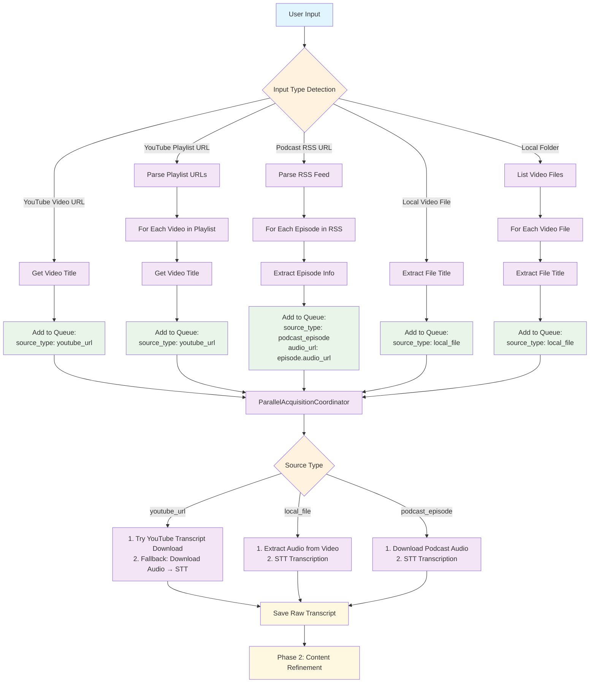
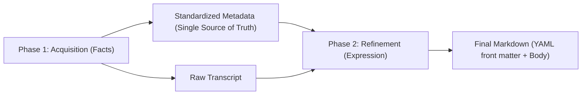

# BodhiFlow: Content to Wisdom Converter - Design Document

## Overview

BodhiFlow is a sophisticated content processing platform that transforms various forms of digital content (videos, audio, podcasts, documents) into structured, refined knowledge. Built on the powerful PocketFlow framework, it implements a two-phase architecture that separates content acquisition from content refinement, allowing for flexible and scalable processing workflows.

The name "BodhiFlow" reflects the application's core mission: channeling the flow of information into wisdom (Bodhi represents enlightenment and deep understanding in Buddhist philosophy). Just as water naturally flows and adapts to its container, BodhiFlow processes diverse content types through intelligent workflows, ultimately crystallizing raw information into refined, actionable knowledge.

## Core Architecture

BodhiFlow is built around a **two-phase processing model** implemented using PocketFlow nodes:

- **Phase 1: Content Acquisition** - Extracting raw content from various sources
- **Phase 2: Content Refinement** - Transforming raw content into polished documents

## Requirements

> Notes for AI: Keep it simple and clear.
> If the requirements are abstract, write concrete user stories

BodhiFlow will transform video content (from YouTube or local files) into structured, refined Markdown documents, accessible via a user-friendly Graphical User Interface (GUI). The GUI will remain active throughout the process, allowing users to track progress. 

> Future requirements will be added/updated to here from "Work in Progress & Future Enhancements" section in TODO.md

**User Stories:**

*   As a user, I want to interact with a GUI to provide inputs, configure settings, and start the video-to-markdown process.
*   As a user, I want to provide a YouTube video URL via the GUI. The system should first try to download existing transcripts. If unavailable, it should download the audio, transcribe it using AI, and then refine the text into a Markdown document.
*   As a user, I want to provide a YouTube playlist URL via the GUI. For each video in the playlist, the system should apply the same logic as for a single YouTube video URL, generating individual Markdown documents.
*   As a user, I want to provide a Podcast RSS feed URL via the GUI. The system should parse the RSS feed to extract episode titles and audio URLs, then download and transcribe each episode's audio using AI, and refine the text into individual Markdown documents.
*   As a user, I want to provide a path to a local video file (e.g., .mp4, .mov, .avi) via the GUI. The system should extract audio, transcribe it using AI, and refine it into a Markdown document.
*   As a user, I want to provide a path to a folder containing multiple local video files via the GUI. For each video, the system should apply the same logic as for a single local video file, generating individual Markdown documents.
*   As a user, I want to select one or more refinement styles (e.g., summary, educational, Q&A) via the GUI, and the generated/extracted text should be refined by an LLM (e.g., Gemini) into corresponding Markdown documents.
*   As a user, I want to optionally provide a browser cookie file path via the GUI to help bypass YouTube rate limits and access restricted content when downloading transcripts or audio for AI Speech-to-Text (STT) processing.
*   As a user, I want to optionally disable AI audio transcription via the GUI checkbox "Disable AI Audio Transcribe". When enabled for YouTube videos/playlists, the system will only attempt to download existing transcripts and will not fall back to audio download + STT, helping to save costs when transcripts are expected to be available.
*   As a user, I want an optional "Save Video" checkbox (default off). When enabled, if the pipeline uses AI transcription (fallback), the downloaded or extracted audio/video source file is moved from temp to the Intermediate Transcript Folder with unique names (no overwrite); for local files, the extracted audio copy is saved. Chunks are not kept.
*   As a user, I want to specify the output language and API keys (Gemini, OpenAI) through the GUI.
*   As a user, I want to see progress updates within the GUI during the processing, and the GUI should remain responsive.
*   As a user, I want to control processing phases via checkboxes: "Phase 1: Get Transcripts Only" for content acquisition only, or "Phase 2: Refine Downloaded Transcripts Only" for refinement only. These options should be mutually exclusive with appropriate UI state management.

**Key GUI Elements:**
*   Input field for YouTube URL / Playlist URL / Podcast RSS URL / Local File Path / Local Folder Path.
*   Phase control checkboxes (right side of Input Source): "Phase 1: Get Transcripts Only" and "Phase 2: Refine Downloaded Transcripts Only".
*   Save Video checkbox (default off): when enabled, source audio/video from AI transcription path is saved to Intermediate Transcript Folder; tooltips show on hover (WA_AlwaysShowToolTips).
*   Checkboxes or similar for selecting multiple Refinement Styles.
*   Input field for Output Language.
*   Input fields for API keys: Gemini, ZAI, OpenAI (for STT), DeepSeek.
*   ASR Model dropdown (from `config/models_config.json`, e.g. OpenAI gpt-4o-transcribe, ZAI GLM-ASR-2512).
*   Phase 2 Model dropdown (e.g. ZAI GLM-7 Flash, Gemini 2.5 Pro, DeepSeek V3.2, OpenAI gpt-5-mini).
*   Input field/file picker for Cookie file path (optional).
*   Intermediate Transcript Folder picker (optional) - allows users to specify custom location for raw transcript files.
*   Output folder selection/picker.
*   Optional: Start and End video indices for playlist processing.
*   "Start Processing" button.
*   Status/Progress display area (e.g., text area or progress bar).

**Inputs (Collected via GUI):**
*   YouTube video URL (string) / Playlist URL / Podcast RSS URL / Local File Path / Local Folder Path OR "No Input Allowed" for Phase 2 Only
*   Phase Control: Phase 1 Only checkbox, Phase 2 Only checkbox (mutually exclusive)
*   Path to `cookie.txt` (optional, for YouTube API rate limit bypass and restricted content access)
*   Intermediate Transcript Folder path (optional, defaults to `{output_base_dir}/intermediate_transcripts/`)
*   Selected Refinement Style(s) (list of strings)
*   Output Language (string)
*   Gemini API Key (string)
*   ZAI API Key (string)
*   OpenAI API Key (string)
*   DeepSeek API Key (string)
*   ASR Model ID (string, from config, e.g. `openai/gpt-4o-transcribe`)
*   Phase 2 Model ID (string, from config, e.g. `zai/glm-7-flash`)

**Outputs:**
*   Formatted Markdown file(s) – one file per video per selected refinement style.
*   Progress and status messages displayed in the GUI, which remains active.

## Flow Design

> Notes for AI:
> 1. Consider the design patterns of agent, map-reduce, rag, and workflow. Apply them if they fit.
> 2. Present a concise, high-level description of the workflow.

The system operates in **two distinct phases** to optimize parallelization and allow users to experiment with different refinement styles without re-processing videos:

**Phase 1: Content Acquisition** - Extract raw transcripts from all video sources using multi-processing for A/V work and async for AI transcription.

**Phase 2: Content Refinement** - Transform raw transcripts into styled markdown using async for LLM API calls.

Users can run Phase 1 once, then experiment with different refinement styles in Phase 2 multiple times.

### Applicable Design Pattern:

1.  **Two-Phase Workflow**: Clear separation between content acquisition and content refinement phases.
2.  **Map-Reduce**: 
    - **Map**: Each video/URL is processed in parallel during Phase 1 to extract raw transcripts.
    - **Reduce**: All raw transcripts are collected as intermediate files.
    - **Map**: Each raw transcript is refined in parallel during Phase 2 for each selected style.
3.  **Strategy/Fallback**: For YouTube videos, attempt transcript download first; fallback to audio STT.
4.  **Parallel/Async**: Multi-processing for CPU/I-O intensive tasks, async for API calls.

### Flow High-Level Design:

1.  **GUI Interaction (Main Thread)**:
    *   User provides inputs and selects phase(s) to run.
    *   GUI collects parameters (`flow_params`) including `run_phase_1` and `run_phase_2` flags.
    *   GUI launches `PocketFlowRunner` QThread.

2.  **Phase 1: Content Acquisition (if enabled)**:
    *   **Multi-Processing**: Audio/video processing (extraction, chunking) runs in separate processes.
    *   **Async**: AI transcription API calls run concurrently.
    *   **Output**: Raw transcript files saved to intermediate directory.

3.  **Phase 2: Content Refinement (if enabled)**:
    *   **Input**: Raw transcript files from Phase 1 (or existing files).
    *   **Async**: LLM refinement API calls run concurrently for all transcript-style combinations.
    *   **Output**: Final styled markdown files.

#### Task Flow

```mermaid
graph TD
    subgraph MainGUIThread ["Main GUI Thread"]
        UserInput["User Selects Phase 1/2 + Inputs via GUI<br/>(YouTube/Playlist/Podcast RSS/Local Files)"] --> StartClick{User Clicks Start}
        StartClick --> CollectParams[GUI Collects flow_params with Phase Flags]
        CollectParams --> LaunchRunner[Launch PocketFlowRunner QThread]
        LaunchRunner --> GUIRemainsActive[GUI Remains Active for Progress Display]
        
        RunnerSignals[Runner Emits Progress/Status Signals] -.-> GUIRemainsActive
    end

    subgraph PocketFlowWorkerThread ["PocketFlow Worker Thread - Two-Phase Processing"]
        InitSharedMemory[Initialize shared_memory from flow_params] --> PhaseDecision{Which Phase?}
        
        PhaseDecision -->|Phase 1 Enabled| Phase1Start[PHASE 1: Content Acquisition]
        PhaseDecision -->|Phase 2 Only| Phase2Start[PHASE 2: Content Refinement]
        
        subgraph Phase1 ["PHASE 1: Content Acquisition (Multi-Process + Async)"]
            Phase1Start --> InputExpansion["InputExpansionNode: Create video_sources_queue<br/>(YouTube/Playlist/RSS/Local Files)"]
            InputExpansion --> ParallelAcquisition[ParallelAcquisitionCoordinator]
            
            ParallelAcquisition --> ProcessPool[Create Process Pool for A/V Work]
            ProcessPool --> AsyncManager[Create Async Manager for API Calls]
            
            subgraph MultiProcessing ["Multi-Processing (A/V Processing)"]
                MP1[Process 1: Audio Extraction]
                MP2[Process 2: Audio Chunking] 
                MP3[Process N: Parallel A/V Work]
            end
            
            subgraph AsyncProcessing ["Async Processing (API Calls)"]
                AsyncSTT[Async: STT API Calls]
                AsyncTranscript[Async: YouTube Transcript Downloads]
                AsyncPodcastDownload[Async: Podcast Audio Downloads]
            end
            
            AsyncManager --> MultiProcessing
            AsyncManager --> AsyncProcessing
            
            MultiProcessing --> RawTextAggregation[Aggregate Raw Transcripts]
            AsyncProcessing --> RawTextAggregation
            
            RawTextAggregation --> SaveRawTranscripts[Save Raw Transcript Files to Intermediate Dir]
            SaveRawTranscripts --> Phase1Complete[Phase 1 Complete]
        end
        
        Phase1Complete --> CheckPhase2{Run Phase 2?}
        CheckPhase2 -->|Yes| Phase2Start
        CheckPhase2 -->|No| FlowComplete[Flow Complete]
        
        subgraph Phase2 ["PHASE 2: Content Refinement (Async LLM Calls)"]
            Phase2Start --> LoadRawTranscripts[Load Raw Transcript Files]
            LoadRawTranscripts --> CreateRefinementTasks[Create All Transcript-Style Combinations]
            CreateRefinementTasks --> AsyncRefinementManager[Async Refinement Coordinator]
            
            subgraph AsyncRefinement ["Async LLM Refinement"]
                AsyncLLM1[Async: LLM Call 1]
                AsyncLLM2[Async: LLM Call 2]
                AsyncLLMN[Async: LLM Call N]
            end
            
            AsyncRefinementManager --> AsyncRefinement
            AsyncRefinement --> SaveMarkdownFiles[Save Final Markdown Files]
            SaveMarkdownFiles --> Phase2Complete[Phase 2 Complete]
        end
        
        Phase2Complete --> FlowComplete
        
        %% Progress Reporting
        InputExpansion -.-> ProgressReporter[Report Progress to GUI]
        ParallelAcquisition -.-> ProgressReporter
        RawTextAggregation -.-> ProgressReporter
        AsyncRefinementManager -.-> ProgressReporter
        SaveMarkdownFiles -.-> ProgressReporter
        ProgressReporter -.-> RunnerSignals
    end

    LaunchRunner --> InitSharedMemory

    %% Styling
    classDef decision fill:#f9f,stroke:#333,stroke-width:2px
    classDef process fill:#9cf,stroke:#333,stroke-width:2px
    classDef async fill:#9ff,stroke:#333,stroke-width:2px
    classDef multiproc fill:#ff9,stroke:#333,stroke-width:2px
    classDef io fill:#ccf,stroke:#333,stroke-width:2px
    classDef thread fill:#lightgrey,stroke:#333,stroke-width:2px
    classDef guiop fill:#c9c,stroke:#333,stroke-width:2px
    classDef phase fill:#f0f8ff,stroke:#333,stroke-width:3px

    class MainGUIThread,PocketFlowWorkerThread thread
    class Phase1,Phase2 phase
    class UserInput,StartClick,CollectParams,LaunchRunner,GUIRemainsActive guiop
    class PhaseDecision,CheckPhase2 decision
    class AsyncSTT,AsyncTranscript,AsyncLLM1,AsyncLLM2,AsyncLLMN,AsyncRefinementManager,AsyncManager async
    class MP1,MP2,MP3,ProcessPool multiproc
    class InitSharedMemory,Phase1Start,Phase2Start,InputExpansion,ParallelAcquisition,RawTextAggregation,SaveRawTranscripts,LoadRawTranscripts,CreateRefinementTasks,SaveMarkdownFiles,Phase1Complete,Phase2Complete,FlowComplete process
    class RunnerSignals,ProgressReporter io
```


#### Type Handling


#### Text entry (PDF / Word / webpage / TXT) and document folder

- **Input types**: `text_file` (.txt), `pdf_file` (.pdf), `word_file` (.docx), `webpage_url` (http(s) URL matched as webpage by config), `document_folder` (folder of .txt/.pdf/.docx/.html; chosen via "Select Document Folder" so path is treated as documents, not media).
- **URL classification**: `config/url_source_config.json` defines `url_sources` with `domain_patterns`. First match wins; `"*"` means match any host (e.g. webpage_text). Other entries are host substring match (e.g. bilibili). Unmatched http(s) → `unknown_url` (GUI shows error).
- **Phase 1 text branch**: When `source_type == "text_document"`, Phase 1 does **not** run STT. It calls `extract_text_from_file(path)` or `extract_text_from_url(url, temp_dir)` from `utils/text_extractor.py` (MarkItDown), then `save_raw_transcript(...)` to intermediate dir. Phase 2 then uses these raw transcript files as usual.
- **Utils**: `utils/text_extractor.py` — `extract_text_from_file(file_path)`, `extract_text_from_url(url, temp_dir)`; `utils/input_handler.py` — `get_input_type(input_path, input_mode_hint=None)`, `list_document_files_in_folder(folder_path)`.

#### CSV batch processing

- **Purpose**: One run processes multiple inputs; each row can override styles, language, and output subdirectory.
- **CSV columns** (header case-insensitive): `input` (required), `styles` (comma-separated, must match GUI style names), `language`, `output_subdir` (relative to `output_base_dir`), `run_phase_1`, `run_phase_2` (reserved; in GUI CSV mode both phases always run).
- **Shared state (CSV mode)**: `csv_path`, `csv_jobs` (list of `{job_id, input, styles, language, output_subdir, ...}`), `job_overrides` (dict job_id → overrides), `transcript_file_to_job_id` (path → job_id after Phase 1). Queue items carry `job_id`.
- **Phase 2**: RefinementTaskCreatorNode groups transcripts by `job_id`, uses `job_overrides[job_id]` for styles and `output_subdir`, and calls `create_refinement_tasks` per job.
- **GUI**: Input Source row has ComboBox "单次输入" / "CSV 批处理". CSV mode shows "CSV 文件" + file picker; Phase checkboxes disabled; Start requires a valid CSV path. Single run uses path/URL as today.


## Metadata as a First-Class Citizen

We separate facts from expression and make metadata a stable, reusable artifact across styles.

- Facts-first: `source_url`, `author/channel`, `published_at`, `duration`, and source-provided `tags` come from the source system (YouTube/Podcast/File), not the LLM.
- Style-agnostic reuse: all refined outputs (Summary/Educational/…) share the same standardized metadata.
- Front matter ready: final Markdown adds a YAML front matter for publishing/search.

### High-level flow (metadata)



### Metadata schema (front matter)
- Required: `title`, `source_type`, `source_url`, `author`, `published_at`, `language`
- Rendering-related: `style`, `description`, `tags[]`
- Ops/trace: `fetched_at`, `pipeline_version` (optional: `duration`, `transcript_chars`, `model_used`)


## Utility Functions

> Notes for AI:
> 1. Understand the utility function definition thoroughly by reviewing the doc.
> 2. Include only the necessary utility functions, based on nodes in the flow.

1.  **`get_input_type(input_path: str, input_mode_hint: str | None = None) -> str`** (`utils/input_handler.py`)
    *   *Input*: `input_path` (str), optional `input_mode_hint` — "media_folder" or "document_folder" when user chose the corresponding folder button.
    *   *Output*: "youtube_video_url", "youtube_playlist_url", "teams_meeting_url", "podcast_rss_url", "file", "folder"; or "text_file", "pdf_file", "word_file", "webpage_url", "document_folder" (when path/URL matches); "unknown_url" for unmatched http(s).
    *   *Necessity*: Route input to the correct path; URL type for http(s) comes from `config/url_source_config.json` (domain_patterns).

2.  **`get_video_urls_from_playlist(playlist_url: str, cookie_path: str | None) -> list[str]`** (`utils/youtube_downloader.py`)
    *   *Input*: `playlist_url` (str) - YouTube playlist URL, `cookie_path` (optional).
    *   *Output*: `list[str]` - List of individual YouTube video URLs.
    *   *Necessity*: To expand a playlist URL. (PytubeFix might be used here, cookies potentially for playlist visibility).

3.  **`download_youtube_transcript(video_url: str, cookies_path: Optional[str] = None, max_retries: int = 3) -> str | None`** (`utils/transcript_fetcher.py`)
    *   *Input*: `video_url` (str), `cookies_path` (Optional[str]) - Path to Netscape format cookies file, `max_retries` (int) - Maximum retry attempts.
    *   *Output*: `str` (transcript text) or `None` if unavailable.
    *   *Necessity*: To get existing YouTube captions/subtitles with retry mechanism for network reliability. Uses `youtube_transcript_api` with automatic retries for network-related errors (but not for definitive "no transcript" errors). Supports exponential backoff (1s, 2s, 4s) and cookies for rate limit bypass and restricted content access.

4.  **`download_youtube_audio(video_url: str, output_path: str, cookie_path: str | None) -> str | None`** (`utils/youtube_downloader.py`)
    *   *Input*: `video_url` (str), `output_path` (str) - dir to save audio, `cookie_path` (optional).
    *   *Output*: `str` (Path to downloaded M4A audio file) or `None` on failure.
    *   *Necessity*: Fallback for YouTube if transcripts fail; uses `yt-dlp`.

5.  **`extract_audio_from_video(video_path: str, output_path: str) -> str | None`** (`utils/acquisition_processor.py`)
    *   *Input*: `video_path` (str) - local video, `output_path` (str) - path for output (extension determines format).
    *   *Output*: `str` (Path to extracted audio file) or `None` on failure. Format is inferred from `output_path`: if it ends with `.mp3`, output is MP3 (used when ZAI GLM-ASR is selected to save space and avoid re-encoding); otherwise M4A (AAC).
    *   *Necessity*: To get audio from local video files. (Uses `ffmpeg`).

6.  **`chunk_audio_on_silence(audio_path: str, output_dir: str) -> list[str]`** (`utils/audio_chunker.py`)
    *   *Input*: `audio_path` (str), `output_dir` (str), optional `min_chunk_duration`, `max_chunk_duration` (from `config.asr_config` when set, e.g. GLM-ASR-2512: 30 s).
    *   *Output*: `list[str]` - Paths to audio chunks.
    *   *Necessity*: To break down audio for STT. Uses ffmpeg for silence detection; fallback time-based chunking uses `min(FALLBACK_CHUNK_DURATION, max_chunk_duration)` so provider limits (e.g. 30 s) are respected.

7.  **`transcribe_audio_chunk_openai(audio_chunk_path: str) -> str | None`** (`utils/speech_to_text.py`)
    *   *Input*: `audio_chunk_path` (str).
    *   *Output*: `str` (Transcribed text) or `None`.
    *   *Necessity*: AI STT for audio chunks. By default, uses the `gpt-4o-transcribe` model (with automatic fallback to `whisper-1` if unavailable) via the OpenAI `/audio/transcriptions` endpoint.

8.  **`refine_text_with_llm(text_content: str, style_prompt_template: str, language: str) -> str`** (`utils/llm_refiner.py`)
    *   *Input*: `text_content` (str), `style_prompt_template` (str from `core/prompts.py`), `language` (str).
    *   *Output*: `str` - Refined Markdown.
    *   *Necessity*: To transform raw text into styled Markdown using an LLM (e.g., Gemini). Will internally use `call_llm`.

9.  **`call_llm(prompt: str, model_name: str) -> str`** (`utils/call_llm.py`)
    *   *Input*: `prompt` (str), `model_name` (str, e.g., "gemini-1.5-pro-latest").
    *   *Output*: `response` (str).
    *   *Necessity*: Generic LLM call.

10. **`save_text_to_file(content: str, file_path: str)`** (`utils/file_saver.py`)
    *   *Input*: `content` (str), `file_path` (str).
    *   *Output*: None.
    *   *Necessity*: To save final Markdown.

11. **`list_video_files_in_folder(folder_path: str) -> list[str]`** (`utils/input_handler.py`)
    *   *Input*: `folder_path` (str).
    *   *Output*: `list[str]` - Video/audio file paths (.mp4, .mp3, .wav, etc.).
    *   *Necessity*: For media folder input.

12. **`list_document_files_in_folder(folder_path: str) -> list[str]`** (`utils/input_handler.py`)
    *   *Input*: `folder_path` (str).
    *   *Output*: `list[str]` - Document file paths (.txt, .pdf, .docx, .html) in that directory (flat).
    *   *Necessity*: For document folder input.

13. **`extract_text_from_file(file_path: str) -> str`** (`utils/text_extractor.py`)
    *   *Input*: `file_path` (str) - Path to .txt, .pdf, .docx, .html, etc.
    *   *Output*: Extracted plain text (MarkItDown).
    *   *Necessity*: Phase 1 text_document branch for local files.

14. **`extract_text_from_url(url: str, temp_dir: str) -> str`** (`utils/text_extractor.py`)
    *   *Input*: `url` (str), `temp_dir` (str) for temporary HTML if needed.
    *   *Output*: Extracted text from webpage.
    *   *Necessity*: Phase 1 text_document branch for webpage_url.

15. **`get_video_title(video_url: str) -> str`** (`utils/youtube_downloader.py`)
    *   *Input*: `video_url` (str).
    *   *Output*: `str` - The title of the YouTube video, cleaned for use as a filename. Returns "Untitled_Video" on failure.
    *   *Necessity*: To get a user-friendly and filesystem-safe name for output files derived from YouTube videos. Uses `pytubefix` with a `yt-dlp` fallback.

16. **`clean_filename(filename: str) -> str`** (`utils/input_handler.py`; also in `utils/youtube_downloader.py` for compatibility)
    *   *Input*: `filename` (str) - The original string intended for use as a filename.
    *   *Output*: `str` - A filename with invalid characters replaced and length limited to 80 characters (room for suffixes like _source_audio.ext).
    *   *Necessity*: To ensure that video titles or other generated names are safe for use as filenames across different operating systems.

17. **`get_video_info(video_path: str) -> dict`** (`utils/acquisition_processor.py`)
    *   *Input*: `video_path` (str) - Path to the local video file.
    *   *Output*: `dict` - A dictionary containing video metadata such as duration, size, codecs, width, height, etc. Returns an empty dictionary on failure.
    *   *Necessity*: To obtain technical details about a video file, which can be useful for logging, pre-processing decisions, or advanced features. Uses `ffmpeg-python`.

18. **`transcribe_audio_chunks(chunk_paths: list[str], asr_config: Optional[dict], api_key: Optional[str]) -> str`** (`utils/speech_to_text.py`)
    *   *Input*: `chunk_paths` (list[str]) - Paths to audio chunks. `asr_config` (Optional[dict]) - provider (openai/zai), model_name, api_key; when provider is zai, chunks are sent to ZAI GLM-ASR (only .wav/.mp3 accepted; non-mp3/wav chunks are converted to MP3 on the fly). `api_key` (Optional[str]) for OpenAI when asr_config is not used.
    *   *Output*: `str` - The combined transcript text from all successfully transcribed chunks.
    *   *Necessity*: Higher-level transcription of multiple segments; dispatches by ASR provider. Chunks are processed sequentially per source; Phase 1 process count is capped by ASR `max_concurrency` when set.

19. **`estimate_transcription_cost(audio_duration_seconds: float) -> float`** (`utils/speech_to_text.py`)
    *   *Input*: `audio_duration_seconds` (float) - The total duration of audio to be transcribed, in seconds.
    *   *Output*: `float` - The estimated cost in USD for transcribing the audio using OpenAI's Whisper model (based on current pricing).
    *   *Necessity*: To provide users with an upfront estimate of potential costs associated with AI transcription services.

## NEW: Two-Phase Architecture Support Functions

20. **`save_raw_transcript(content: str, video_title: str, intermediate_dir: str) -> str`** (`utils/file_saver.py`)
    *   *Input*: `content` (str) - Raw transcript text, `video_title` (str) - Video title for filename, `intermediate_dir` (str) - Directory to save.
    *   *Output*: `str` - Path to saved transcript file.
    *   *Necessity*: Save raw transcripts from Phase 1 for Phase 2 processing.

21. **`load_raw_transcript(file_path: str) -> str`** (`utils/file_saver.py`)
    *   *Input*: `file_path` (str) - Path to raw transcript file.
    *   *Output*: `str` - Raw transcript content.
    *   *Necessity*: Load raw transcripts in Phase 2.

22. **`discover_raw_transcript_files(intermediate_dir: str) -> list[str]`** (`utils/file_saver.py`)
    *   *Input*: `intermediate_dir` (str) - Directory containing raw transcript files.
    *   *Output*: `list[str]` - List of transcript file paths.
    *   *Necessity*: Find existing transcript files when running Phase 2 only.

23. **`process_single_video_acquisition(video_data: dict, config: dict) -> dict`** (`utils/acquisition_processor.py`)
    *   *Input*: `video_data` (dict) - Video source info, `config` (dict) - Processing configuration (API keys, directories, save_video_on_ai_transcribe, etc.).
    *   *Output*: `dict` - Result with status, transcript_text, error info.
    *   *Necessity*: Single video processing function for multiprocessing pool. Handles YouTube transcript download → STT fallback, local file → STT, or podcast episode → download audio → STT. When `save_video_on_ai_transcribe` is True, moves downloaded/extracted audio (and for Teams the meeting video) to `intermediate_dir` with unique filenames via `_unique_dest_path`; chunks are not saved.

24. **`create_refinement_tasks(transcript_files: list[str], styles_data: list[tuple], output_dir: str) -> list[dict]`** (`utils/llm_refiner.py`)
    *   *Input*: `transcript_files` (list[str]) - Paths to raw transcript files, `styles_data` (list[tuple]) - Style definitions, `output_dir` (str) - Output directory.
    *   *Output*: `list[dict]` - List of refinement tasks with transcript_file, style_name, style_prompt, output_file.
    *   *Necessity*: Create all transcript × style combinations for Phase 2 async processing.

25. **`async_refine_single_task(task: dict, gemini_config: dict) -> dict`** (`utils/llm_refiner.py`)
    *   *Input*: `task` (dict) - Single refinement task, `gemini_config` (dict) - Gemini API configuration.
    *   *Output*: `dict` - Result with status, output_file, error info.
    *   *Necessity*: Async wrapper for single refinement task, used by AsyncRefinementCoordinator.

**Logging & Debugging Support Functions**

26. **`setup_logger(name: str = None) -> logging.Logger`** (`utils/logger_config.py`)
    *   *Input*: `name` (str, optional) - Logger name, defaults to root logger.
    *   *Output*: `logging.Logger` - Configured logger instance.
    *   *Necessity*: Initialize comprehensive logging system with multiple handlers (console, rotating file, error file) and appropriate formatters. Creates logs/ directory structure automatically.

27. **`get_logger(name: str) -> logging.Logger`** (`utils/logger_config.py`)
    *   *Input*: `name` (str) - Module name for the logger (typically `__name__`).
    *   *Output*: `logging.Logger` - Pre-configured logger for the specified module.
    *   *Necessity*: Provide module-specific loggers with consistent configuration across the application. Supports debug, info, warning, and error levels with appropriate file rotation.

**RSS/Podcast Support Functions**

28. **`parse_podcast_rss(rss_url: str, start_index: int = 1, end_index: int = 0) -> list[dict]`** (`utils/podcast_parser.py`)
    *   *Input*: `rss_url` (str) - Podcast RSS feed URL, `start_index` (int) - First episode to process (1-based), `end_index` (int) - Last episode to process (0 for all).
    *   *Output*: `list[dict]` - List of episode info: `[{"title": str, "audio_url": str, "description": str, "pub_date": str, "duration": str}, ...]`.
    *   *Necessity*: Parse RSS feed to extract podcast episode information. Uses `feedparser` library to handle various RSS/Atom feed formats.

29. **`download_podcast_audio(audio_url: str, output_path: str, episode_title: str) -> str | None`** (`utils/podcast_parser.py`)
    *   *Input*: `audio_url` (str) - Direct URL to podcast audio file, `output_path` (str) - Directory to save audio, `episode_title` (str) - Episode title for filename.
    *   *Output*: `str` (Path to downloaded audio file) or `None` on failure.
    *   *Necessity*: Download podcast audio files from direct URLs. Handles various audio formats (MP3, M4A, etc.) and implements retry logic for network issues.

30. **`get_podcast_info(rss_url: str) -> dict`** (`utils/podcast_parser.py`)
    *   *Input*: `rss_url` (str) - Podcast RSS feed URL.
    *   *Output*: `dict` - Podcast metadata: `{"title": str, "description": str, "total_episodes": int, "language": str, "author": str}`.
    *   *Necessity*: Extract podcast-level metadata for logging and user information. Helps users understand what they're processing.


### NEW: Metadata Support Functions

28. `normalize_metadata(source_type: str, raw: dict) -> dict` (`utils/metadata.py`)
    - Output: unified keys; `published_at` as ISO8601; `tags` normalized.

29. `save_metadata_for_transcript(video_title: str, metadata: dict, intermediate_dir: str) -> str` (`utils/file_saver.py`)
    - Save `{video_title}.meta.json` next to raw transcript.

30. `load_metadata_for_transcript(video_title: str, intermediate_dir: str) -> dict` (`utils/file_saver.py`)
    - Load `.meta.json`; if missing, return minimal fields.

31. `build_yaml_front_matter(metadata: dict) -> str` (`utils/metadata.py`)
    - Return a safe YAML string with the schema above.

32. `fetch_youtube_metadata(video_url: str, cookie_path: str|None) -> dict` (`utils/youtube_downloader.py`)
    - Use `yt-dlp` extract_info(download=False). If it fails, return minimal fields (`title`, `source_url`) without interrupting the main flow.

33. `enhance_metadata_with_llm(text: str, language: str, model: str) -> dict` (`utils/meta_infer.py`)
    - Use OpenAI Responses API with model=`gpt-5-nano` (default) and the `Metadata Enhancement` prompt in `core/prompts.py`.
    - Output: `{ "description": str, "tags": [str,...] }` (desc <= 140 chars; 3–5 short tags).

34. Model configuration (`config/models_config.json`, `utils/models_config.py`)
    - JSON config defines `asr_models` and `phase2_models` (id, label, provider, model_name, optional default).
    - Optional **Phase 2**: `max_concurrency` (int) — when set (e.g. ZAI GLM-4.7-Flash: 1), GUI sets `max_workers_async` from `get_phase2_model_max_concurrency(phase2_model_id)` so refinement runs with that concurrency and avoids rate limits.
    - Optional **ASR**: `max_chunk_duration_seconds` (int) — when set (e.g. ZAI GLM-ASR-2512: 30), Phase 1 passes it in `asr_config`; `chunk_audio_on_silence` uses it so audio is sliced before STT. **ASR** `max_concurrency` (int) — when set (e.g. ZAI GLM-ASR-2512: 5), Phase 1 parallel workers are capped via `get_asr_model_max_concurrency(asr_model_id)` in the runner so the number of concurrent ASR API calls does not exceed the provider limit.
    - `get_asr_models()`, `get_phase2_models()`, `get_default_asr_id()`, `get_default_phase2_id()`, `get_model_by_id(id, kind)`, `get_asr_model_max_concurrency(asr_model_id)`.
    - Phase 2 LLM routing: `call_llm(prompt, provider_config)` supports provider in {gemini, openai, deepseek, zai}.
    - ASR routing: `transcribe_audio_chunks(chunk_paths, asr_config)` supports provider in {openai, zai}. When ZAI is selected, acquisition uses MP3 for extract/chunk (local and Teams) so no format conversion is needed at STT time.

35. UI configuration (`config/ui_config.json`, `utils/ui_config.py`)
    - `get_ui_config()` loads defaults for: `language` (e.g. 简体中文), `default_checked_styles` (bool per style), `chunk_size`, `options` (resume, metadata_enhance, phase2_skip_existing, etc.). GUI reads these at startup; no `.env` for language.


## Node Design

### Shared Memory

```python
shared = {
    # Populated by PocketFlowRunner from GUI's flow_params
    "user_input_path": None,         # str: Initial user input (URL, file, or folder path)
    "cookie_file_path": None,        # str | None: Path to cookie file
    "selected_styles_data": [],      # list[tuple[str, str]]: e.g., [("Summary", "<prompt>"), ...]
    "output_language": "English",    # str
    "gemini_api_key": None,          # str
    "openai_api_key": None,          # str
    "zai_api_key": None,             # str
    "deepseek_api_key": None,        # str
    "asr_model_id": "openai/gpt-4o-transcribe",  # str: ASR model id from config
    "phase2_model_id": "zai/glm-7-flash",       # str: Phase 2 LLM model id from config
    "output_base_dir": "./output",   # str
    "intermediate_dir": "{output_base_dir}/intermediate_transcripts", # str: Raw transcript files from Phase 1 (user-configurable)
    "temp_dir": "./temp_bodhiflow",     # str: Temporary audio files, chunks (cleaned after Phase 1)
    "start_index": 1,                # int
    "end_index": 0,                  # int (0 for all)
    "llm_chunk_size": 70000,         # int
    "resume_mode": True,             # bool (default from config/ui_config.json)
    "phase2_skip_existing": True,    # bool: skip Phase 2 for outputs that already exist (default from ui_config)
    "disable_ai_transcribe": False,  # bool: When True, YouTube videos only use downloaded transcripts, no STT fallback
    "save_video_on_ai_transcribe": False,  # bool: When True, on AI transcription fallback move downloaded audio/video to intermediate_dir (unique names; chunks not saved)
    "selected_gemini_model": None,   # str (legacy; phase2_model_id is primary)

    # Phase Control
    "run_phase_1": True,             # bool: Run content acquisition phase (False if Phase 2 Only checked)
    "run_phase_2": True,             # bool: Run content refinement phase (False if Phase 1 Only checked)
    "phase_1_only": False,           # bool: Phase 1 Only checkbox state
    "phase_2_only": False,           # bool: Phase 2 Only checkbox state
    "max_workers_processes": 4,      # int: Max processes for Phase 1 (capped by ASR max_concurrency when set, e.g. ZAI GLM-ASR: 5)
    "max_workers_async": 10,         # int: Max concurrent async tasks (API calls)

    # GUI Callbacks (must be thread-safe or emit signals to GUI thread)
    "status_update_callback": None,  # function(message: str, type: StatusType)
    "progress_update_callback": None,# function(progress_percent: int)

    # Phase 1: Content Acquisition State
    "video_sources_queue": [],       # list[dict]: [{"source_path", "source_type": "youtube_url"|"local_file"|"podcast_episode"|"text_document", "original_title", "audio_url" (podcast), "job_id" (CSV)}]
    "raw_transcript_files": [],      # list[str]: Paths to saved raw transcript files from Phase 1
    "transcript_file_to_job_id": {}, # dict: path -> job_id (CSV batch); used by Phase 2 for per-job styles/output_subdir
    "phase_1_results": {},           # dict: {video_title: {"status", "transcript_file", "error", "job_id"}}
    # CSV batch (when csv_path is set)
    "csv_path": None,                # str | None: Path to CSV file
    "csv_jobs": [],                  # list[dict]: [{job_id, input, styles, language, output_subdir, ...}]
    "job_overrides": {},             # dict: job_id -> {styles, language, output_subdir, ...}
    
    # Phase 2: Content Refinement State  
    "refinement_tasks": [],          # list[dict]: [{"transcript_file": str, "style_name": str, "style_prompt": str, "output_file": str}]
    "phase_2_results": {},           # dict: {task_id: {"status": "success/failure", "output_file": "path", "error": "msg"}}
    
    # Final Summary
    "final_outputs_summary": []      # list[dict]: [{"input": str, "style": str, "output_md_path": str, "status": "success/failure"}]
}
```

#### Shared Memory (metadata additions)

```python
# Metadata handling
shared.update({
    "source_metadata": {},               # dict: { title_key: { ...normalized metadata... } }
    "metadata_enhancement_enabled": True,
    "metadata_llm_model": "gpt-5-nano", # fixed model for description/tags enhancement via OpenAI Responses API
})
```

### Node Steps

> **Note on GUI Interaction**: The GUI runs in the main application thread. The PocketFlow (nodes below) runs in a separate worker thread (`PocketFlowRunner`). Nodes will use callbacks provided in `shared_memory` (e.g., `status_update_callback`) to send updates. These callbacks, when executed in the worker thread, must emit Qt signals to safely update the GUI in the main thread.

## PHASE 1: Content Acquisition Nodes

1.  **InputExpansionNode**
    *   *Purpose*: Based on `user_input_path`, populate `video_sources_queue` for Phase 1 processing. Handles "No Input Allowed" for Phase 2 Only mode.
    *   *Type*: Regular
    *   *Steps*:
        *   *prep*: Read `shared["user_input_path"]`, `shared["start_index"]`, `shared["end_index"]`, `shared["phase_2_only"]`, `shared["resume_mode"]`, `shared["intermediate_dir"]`.
        *   *exec*:
            *   If `shared["user_input_path"]` == "No Input Allowed" (Phase 2 Only mode):
                *   Return empty queue `[]` immediately.
            *   Otherwise, call `get_input_type(shared["user_input_path"])`.
            *   if `resume_mode` is enabled and `clean_filename(title)` already exists in existing titles:
                *   Skip and do not transcribe processed video again
            *   If "youtube_playlist_url":
                *   `urls = get_video_urls_from_playlist(shared["user_input_path"], shared["cookie_file_path"])`.
                *   Apply start/end index slicing to `urls`.
                *   For each `url` in (sliced) `urls`: `title = get_video_title(url)`. Add `{"source_path": url, "source_type": "youtube_url", "original_title": title}` to queue.
            *   If "youtube_video_url": `title = get_video_title(shared["user_input_path"])`. Add one item.
            *   If "podcast_rss_url":
                *   `episodes = parse_podcast_rss(shared["user_input_path"], shared["start_index"], shared["end_index"])`.
                *   For each `episode` in `episodes`: Add `{"source_path": episode["audio_url"], "source_type": "podcast_episode", "original_title": clean_filename(episode["title"]), "audio_url": episode["audio_url"]}` to queue.
            *   If "folder":
                *   `files = list_video_files_in_folder(shared["user_input_path"])`.
                *   Apply start/end index slicing to `files`.
                *   For each `file_path` in (sliced) `files`: `title = Path(file_path).stem`. Add `{"source_path": file_path, "source_type": "local_file", "original_title": title}`.
            *   If "file": `title = Path(shared["user_input_path"]).stem`. Add one item.
            *   If "text_file" / "pdf_file" / "word_file" / "webpage_url": Add one item with `source_type: "text_document"` (no STT in Phase 1; text extraction only).
            *   If "document_folder": `files = list_document_files_in_folder(path)`; for each file add item `source_type: "text_document"`.
            *   When `shared["csv_jobs"]` is non-empty, expand from each job's `input` (with `job_id` on every queue item) instead of `user_input_path`.
        *   *post*: Write to `shared["video_sources_queue"]`.
        *   *Action*: "start_parallel_acquisition" if queue is not empty, else "phase_1_complete_no_input".

2.  **ParallelAcquisitionCoordinatorNode**
    *   *Purpose*: Coordinate multi-processing (A/V work) and async (API calls) for all videos in queue.
    *   *Type*: Parallel (uses Process Pool + Async Task Manager)
    *   *Steps*:
        *   *prep*: Read `shared["video_sources_queue"]`, `shared["max_workers_processes"]`, `shared["max_workers_async"]`.
        *   *exec*:
            *   Create process pool with `multiprocessing.Pool(processes=shared["max_workers_processes"])`.
            *   Create async task manager using `asyncio` with max concurrent tasks = `shared["max_workers_async"]`.
            *   For each video in queue:
                *   If YouTube: Submit async task for transcript download first, with STT fallback if needed.
                *   If local file: Submit process task for audio extraction + async task for STT.
                *   If podcast episode: Submit async task for audio download + async task for STT.
            *   Collect all results as they complete, updating `shared["phase_1_results"]`.
            *   Save each successful raw transcript to `shared["intermediate_dir"]` as `{video_title}_raw_transcript.txt`.
            *   Collect and normalize factual metadata (title/channel/upload_date/duration/source_url/tags) per item and persist a sidecar `{video_title}.meta.json`. Update `shared["source_metadata"]`.
        *   *post*: Update `shared["raw_transcript_files"]`; build `shared["transcript_file_to_job_id"]` (path → job_id) from results for CSV mode.
        *   *Action*: "phase_1_complete" when all tasks finish.

## PHASE 2: Content Refinement Nodes

3.  **RefinementTaskCreatorNode**
    *   *Purpose*: Create all combinations of transcript files × refinement styles for Phase 2 processing.
    *   *Type*: Regular
    *   *Steps*:
        *   *prep*: Read `shared["raw_transcript_files"]`, `shared["selected_styles_data"]`, `shared["transcript_file_to_job_id"]`, `shared["job_overrides"]`, `shared["phase_2_only"]`, `shared["resume_mode"]`. If Phase 2 Only or resume, discover existing files in `shared["intermediate_dir"]`.
        *   *exec*:
            *   If `transcript_file_to_job_id` and `job_overrides` are present (CSV batch): group transcripts by `job_id`; for each job use `job_overrides[job_id]` for styles and `output_subdir`; call `create_refinement_tasks` per job and merge task lists.
            *   Else: single call `create_refinement_tasks(transcript_files, styles_data, output_base_dir)` as before (per-file, per-style tasks with output filename `{video_title} [{safe_style_name}].md`).
        *   *post*: Write to `shared["refinement_tasks"]`.
        *   *Action*: "start_async_refinement" if tasks exist, else "phase_2_complete_no_tasks".

4.  **AsyncRefinementCoordinatorNode**
    *   *Purpose*: Process all refinement tasks concurrently using async LLM calls.
    *   *Type*: Async (uses AsyncIO task manager)
    *   *Steps*:
        *   *prep*: Read `shared["refinement_tasks"]`, `shared["max_workers_async"]`, `shared["phase2_model_id"]` (or `selected_gemini_model`), all provider API keys, `shared["llm_chunk_size"]`, `shared["output_language"]`. Resolve `phase2_model_id` via `get_model_by_id(..., "phase2")` to build `provider_config` (provider, model_name, api_key).
        *   *exec*:
            *   Create async task manager with max concurrent LLM calls = `shared["max_workers_async"]`.
            *   For each task in `refinement_tasks`:
                *   Submit async task to:
                    *   Load raw transcript from `task["transcript_file"]`.
                    *   Call `refine_text_with_llm(..., provider_config=provider_config)` (or legacy model_name/api_key).
                    *   Load standardized metadata from `shared["source_metadata"]` or sidecar `.meta.json`. If `description`/`tags` missing and `metadata_enhancement_enabled`, enhance via LLM (`metadata_llm_model` = gpt-5-nano) using the utility prompt in `core/prompts.py`.
                    *   Build YAML front matter from metadata and prepend to the refined body, then save to `task["output_file"]`.
                *   Update progress via `shared["status_update_callback"]` as tasks complete.
            *   Collect all results, updating `shared["phase_2_results"]`.
        *   *post*: Update `shared["final_outputs_summary"]` with all successful outputs.
        *   *Action*: "phase_2_complete".

## Utility Nodes

5.  **TempFileCleanupNode**
    *   *Purpose*: Clean up temporary audio files and chunks after Phase 1 completion.
    *   *Type*: Regular
    *   *Steps*:
        *   *prep*: Read `shared["temp_dir"]`.
        *   *exec*:
            *   Recursively delete all files in `shared["temp_dir"]`.
            *   Call `shared["status_update_callback"]("Temporary files cleaned up.", StatusType.INFO)`.
        *   *post*: None.
        *   *Action*: "cleanup_complete".

6.  **FlowCompletionNode**
    *   *Purpose*: Generate final summary and complete the flow.
    *   *Type*: Regular  
    *   *Steps*:
        *   *prep*: Read `shared["final_outputs_summary"]`, `shared["phase_1_results"]`, `shared["phase_2_results"]`.
        *   *exec*:
            *   Generate comprehensive summary of all processed videos and generated files.
            *   Call `shared["status_update_callback"](summary_message, StatusType.SUCCESS)`.
        *   *post*: None.
        *   *Action*: "flow_complete".

## Output Contract

- Each final Markdown begins with YAML front matter using the standardized schema.
- Factual fields (`author`, `published_at`, `source_url`, `duration`) come from source adapters only.
- `description`/`tags`:
  - Prefer source-provided; if missing, enhance via `gpt-5-nano` (OpenAI) using the Responses API and `core/prompts.py`’s `Metadata Enhancement` prompt.
- All timestamps ISO8601 (UTC); `tags` de-duplicated and normalized.

### Example: Responses API for metadata enhancement (gpt-5-nano)

```python
# utils/meta_infer.py
# Migrated to Responses API – see docs 2025-03-11
from openai import OpenAI
import os, json
from core.prompts import utility_prompts  # contains "Metadata Enhancement"

def enhance_metadata_with_llm(text: str, language: str = "English", model: str = "gpt-5-nano") -> dict:
    """
    Returns: {"description": str, "tags": [str, ...]}
    Uses gpt-5-nano (default) via Responses API to enrich missing non-factual fields only.
    """
    client = OpenAI(api_key=os.getenv("OPENAI_API_KEY"))
    tmpl = utility_prompts["Metadata Enhancement"]
    prompt = tmpl.format(language=language, text=text[:4000])
    resp = client.responses.create(
        model=model,
        input=prompt,
        temperature=0.2,
        max_output_tokens=200,
    )
    raw = resp.output_text.strip()
    try:
        data = json.loads(raw)
        desc = str(data.get("description", "")).strip()[:140]
        tags = [t.strip() for t in (data.get("tags") or [])][:5]
        return {"description": desc, "tags": tags}
    except Exception:
        return {"description": "", "tags": []}
```

