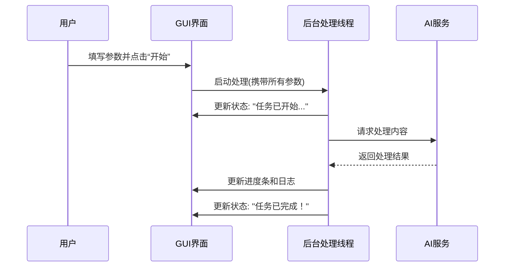

# Chapter 1: 图形用户界面 (GUI)


欢迎来到 BodhiFlow 的世界！这是我们系列教程的第一章。在本章中，我们将一起探索 BodhiFlow 的控制中心——它的图形用户界面（GUI）。

想象一下，你发现了一个非常棒的 YouTube 视频系列，想把它们全部变成一份精美的学习笔记，但你又不想手动复制粘贴字幕，更不想编写任何代码。这该怎么办呢？BodhiFlow 的图形用户界面正是为了解决这个问题而设计的！它就像一个功能强大的工厂控制室，你只需在操作台上按下几个按钮、调整几个旋钮，复杂的“内容加工”流水线就会自动为你工作。

## 什么是图形用户界面？

**图形用户界面**（Graphical User Interface，简称 GUI）是 BodhiFlow 的“脸面”。它将所有复杂的配置选项，比如 API 密钥、处理模式、输出风格等，以清晰直观的方式呈现给你。你通过这个界面下达指令，然后可以实时查看处理进度和日志反馈。

有了它，你完全不需要关心底层代码的复杂性，就能轻松驾驭整个内容处理流程。

让我们来逐一认识一下这个“控制室”里的各个操作区域吧。


### 1. 输入与控制区 (Input & Control)

这是你下达核心指令的地方。

*   **输入源 (Input Source)**：这是整个流程的起点。你可以在这里粘贴 YouTube 视频或播放列表的链接、本地视频/音频文件的路径，甚至是播客的 RSS 地址。BodhiFlow 会自动识别你要处理的内容。
*   **阶段控制 (Phase Control)**：BodhiFlow 的工作主要分为两个阶段：[第一阶段：内容获取](03_第一阶段_内容获取_.md)（例如下载字幕）和 [第二阶段：内容精炼](04_第二阶段_内容精炼_.md)（使用 AI 美化和总结内容）。这两个复选框允许你只执行其中一个阶段，提供了极大的灵活性。
*   **输出语言 (Output Language)**：你希望最终生成的文档是什么语言？在这里输入即可，比如 `简体中文` 或 `English`。默认值来自 `config/ui_config.json`（默认 简体中文）。
*   **视频范围 (Video Range)**：如果输入的是一个包含上百个视频的播放列表，而你只想处理其中的第 5 到第 10 个视频，就可以在这里精确设置范围。

### 2. 精炼风格区 (Refinement Styles)

这部分是 BodhiFlow 的“魔法”所在。你希望 AI 将原始内容转换成什么样子？在这里打勾就行。

*   **例如 "Summary"（摘要）**：生成一份简明扼要的内容总结。
*   **例如 "Balanced and Detailed"（均衡细致）**：生成一份结构清晰、细节丰富的文档。

你可以同时选择多个风格，BodhiFlow 会为每种风格都生成一份独立的文档。

### 3. 目录与密钥区 (Directories & Keys)

这里负责配置“物料”的输入和输出。

*   **输出文件夹 (Output Folder)**：指定所有处理完成的文档最终保存在你电脑的哪个位置。这是必填项。
*   **API 密钥 (API Keys)**：BodhiFlow 依赖强大的 [多供应商AI服务](05_多供应商ai服务_.md) 来完成语音转文字和内容精炼等任务。API 密钥就像是使用这些服务的“通行证”。你需要在这里填入从相应服务商（如 OpenAI, Google Gemini 等）获取的密钥。

### 4. 进度与日志区 (Progress & Logs)

这是你的“仪表盘”，实时显示任务状态。

*   **进度条 (Progress Bar)**：直观地展示当前任务的总体完成度。
*   **状态显示窗口 (Status Display)**：这里会以文本形式详细记录每一步操作的日志，包括成功信息、警告或错误提示。如果处理过程中出现问题，这里是排查线索的最佳地点。

### 5. 控制按钮 (Control Buttons)

*   **Start Processing (开始处理)**：当你完成所有设置后，点击这个按钮，BodhiFlow 就会启动。
*   **Cancel (取消)**：如果在处理过程中想提前中止，可以点击此按钮。

## 实战演练：将 YouTube 教程变为学习笔记

让我们回到最初的场景：将一个 YouTube Python 教程播放列表转换成中文学习笔记。

**操作步骤如下：**

1.  **复制链接**：在 YouTube 上找到该播放列表，复制其 URL。
2.  **粘贴输入源**：将 URL 粘贴到 BodhiFlow GUI 的“Input Source”文本框中。
3.  **设置语言**：在“Output Language”框中输入 `简体中文`。
4.  **选择风格**：在“Refinement Styles”区域，勾选 `Balanced and Detailed` 复选框。
5.  **设置输出位置**：点击“Main Output Folder”旁的“Choose Folder”按钮，选择你桌面上的一个文件夹。
6.  **填入密钥**：在“API Keys”区域填入你的 AI 服务密钥。
7.  **启动！**：点击 `Start Processing` 按钮。

之后，你就可以在下方的状态窗口中看到 BodhiFlow 开始工作的日志了：

```
[INFO] Starting PocketFlow processing with parameters: https://www.youtube.com/playlist?list=...
[INFO] Created output directory: C:/Users/YourName/Desktop/MyNotes
[PROGRESS] Processing video 1 of 10: "Python Basics - Variables"
[PROGRESS] Downloading transcript for video 1...
[PROGRESS] Refining content for video 1 with style 'Balanced and Detailed'...
[SUCCESS] Finished processing video 1. Output saved to C:/.../01_Python Basics - Variables.md
...
[FINISH] Processing complete! Output files should be in folder: C:/Users/YourName/Desktop/MyNotes
```

任务完成后，打开你指定的输出文件夹，就会发现所有视频都已经变成了条理清晰的 `.md` 格式笔记文件！

## 深入幕后：GUI 是如何工作的？

当你点击“Start Processing”按钮时，背后发生了什么？我们可以把这个过程比作在一家高级餐厅点餐。

1.  **你（用户）填写点餐单（GUI 界面）**：你选择了主菜（输入源）、口味（精炼风格）和特殊要求（输出语言）。
2.  **服务员（`start_processing_flow` 函数）收集订单**：服务员会过来取走你的点餐单，确认所有信息都填写无误（输入验证）。
3.  **服务员将订单交给后厨（后台处理线程 `PocketFlowRunner`）**：为了不让你在座位上干等（避免界面卡死），服务员将订单交给后厨团队专门处理。
4.  **后厨开始忙碌（执行 [BodhiFlow 工作流](02_bodhiflow_工作流_.md)）**：后厨的采购部门（第一阶段）去获取食材（下载字幕），烹饪部门（第二阶段）按照你的口味要求进行加工（AI 精炼）。
5.  **上菜进度更新（状态回调）**：后厨会不时告诉服务员：“汤正在炖了！”（进度更新），服务员再把这个消息告诉你（更新 GUI 界面上的日志和进度条）。
6.  **菜品上桌（处理完成）**：所有菜品都准备好后，通知你用餐（弹出完成提示）。

我们可以用一个简单的序列图来展示这个流程：



### 代码一瞥

让我们看看 `gui/main_window.py` 文件中的一些关键代码片段，来理解这个过程是如何用代码实现的。

**1. 创建界面元素 (`initUI` 函数)**

这个函数负责搭建我们看到的所有界面组件，比如输入框。

```python
# 文件: gui/main_window.py

def initUI(self):
    """初始化用户界面"""
    # ... 其他代码 ...
    
    # 创建输入源的标签和输入框
    url_label = QLabel("Input Source (...):")
    self.url_input = QLineEdit()
    self.url_input.setPlaceholderText(
        "Enter YouTube URL..."
    )
    
    # ... 将标签和输入框添加到窗口布局中 ...
```
这段代码非常直白：创建一个标签（`QLabel`）和一行文本输入框（`QLineEdit`），并设置提示文字。`initUI` 函数就是由许许多多这样的小块代码组成的。

**2. 收集用户输入 (`start_processing_flow` 函数)**

当用户点击“开始”按钮时，这个函数会被调用。它的核心任务是从界面上所有组件中读取用户设置，并将它们打包成一个配置字典。

```python
# 文件: gui/main_window.py

def start_processing_flow(self):
    """启动 BodhiFlow 处理流程"""
    # ... 输入验证的代码 ...
    
    # 从界面收集所有参数
    flow_params = {
        "user_input_path": self.url_input.text().strip(),
        "output_language": self.language_input.text().strip(),
        "output_base_dir": self.summary_output_dir_input.text().strip(),
        "gemini_api_key": self.gemini_api_key_input.text().strip(),
        # ... 收集其他所有设置 ...
    }
    
    # ... 启动后台线程，并把 flow_params 传给它 ...
```
这里，`self.url_input.text()` 就是在读取用户在输入框里填写的内容。函数将所有这些信息汇集到 `flow_params` 字典中，然后传递给后台工作线程。

**3. 更新状态显示 (`update_status` 函数)**

这是一个“回调”函数，后台线程通过它来向界面发送消息。

```python
# 文件: gui/main_window.py

@pyqtSlot(str, StatusType)
def update_status(self, message, msg_type=StatusType.INFO):
    """用带颜色的消息更新状态显示窗口"""
    color = STATUS_COLORS.get(msg_type, "#333333") # 根据消息类型获取颜色
    
    # 将带颜色的HTML文本追加到显示窗口
    self.status_display.append(f"<font color='{color}'>{message}</font>")
```
这个函数接收消息文本（`message`）和消息类型（`msg_type`），然后根据类型（如成功、错误、信息）选择一个颜色，最后将格式化后的彩色文本添加到日志窗口中。

## 总结

在本章中，我们详细了解了 BodhiFlow 的图形用户界面（GUI）。我们学习到：

*   GUI 是与 BodhiFlow 强大功能交互的“控制面板”，让非程序员也能轻松使用。
*   GUI 的主要区域包括输入区、风格选择区、配置区和进度显示区。
*   通过一个实际案例，我们学会了如何使用 GUI 将 YouTube 视频转换为学习笔记。
*   我们还简单了解了 GUI 背后的工作原理：它负责收集用户指令，交给后台线程处理，并实时反馈处理状态。

现在你已经掌握了如何驾驶 BodhiFlow 这台强大的“内容处理机器”。在下一章中，我们将打开发动机盖，深入了解驱动这一切的核心引擎。

准备好了吗？让我们进入下一章：[BodhiFlow 工作流](02_bodhiflow_工作流_.md)。

---

Generated by [AI Codebase Knowledge Builder](https://github.com/The-Pocket/Tutorial-Codebase-Knowledge)