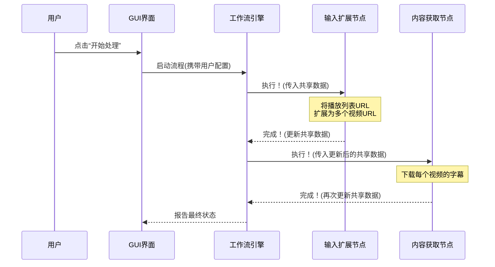

# Chapter 2: BodhiFlow 工作流


在上一章 [图形用户界面 (GUI)](01_图形用户界面__gui__.md) 中，我们学习了如何操作 BodhiFlow 的“控制台”。我们知道了如何输入一个 YouTube 播放列表链接，点击“开始处理”，然后就能得到精美的笔记。但你有没有好奇过，当你点击那个按钮后，背后究竟发生了什么？是什么样的“魔法”将一个简单的链接变成了一份份详细的文档？

答案就是 **BodhiFlow 工作流 (Workflow)**。

如果说 GUI 是工厂的控制室，那么工作流就是这个工厂的**总装配线蓝图**。它精确地规划了原材料（你的输入内容）需要经过哪些工序、以什么样的顺序进行加工，最终才能变成合格的产品（智慧文档）。

本章，我们将一起揭开这层神秘的面纱，探索 BodhiFlow 的核心引擎——工作流。

## 什么是工作流？

想象一下在一家汽车制造厂里，一辆汽车的诞生过程：

1.  **冲压车间**：将钢板冲压成车身部件。
2.  **焊接车间**：将部件焊接成车身框架。
3.  **涂装车间**：为车身喷漆上色。
4.  **总装车间**：安装发动机、座椅、轮胎等。
5.  **质检**：对成品车进行全面检查。

这些车间就是独立的**处理站**，而将它们按特定顺序连接起来、让半成品汽车依次流转的路径，就是**工作流**。

BodhiFlow 的工作流也是如此。它由一系列被称为 **[流程节点 (Node)](06_流程节点__node__.md)** 的处理站组成。每个节点都负责一项单一、具体的工作。数据就像一辆待组装的汽车，从一个节点流向下一个节点，每经过一个节点，它就会被加工或转换，直到最终完成。

一个典型的 BodhiFlow 工作流可以被简化为下图：

```mermaid
graph TD
    A[用户输入<br/>(例如 YouTube 链接)] --> B(输入扩展);
    B --> C{第一阶段<br/>内容获取};
    C --> D(创建精炼任务);
    D --> E{第二阶段<br/>内容精炼};
    E --> F(临时文件清理);
    F --> G[完成<br/>(生成最终文档)];

    subgraph "工作流 (Workflow)"
        B
        C
        D
        E
        F
    end

    style C fill:#f9f,stroke:#333,stroke-width:2px
    style E fill:#ccf,stroke:#333,stroke-width:2px
```

这个蓝图清晰地展示了从原始内容到智慧文档的全过程。接下来，让我们看看构成这个蓝图的几个关键节点。

## BodhiFlow 工作流的构建块

我们的“总装配线蓝图”是在 `core/flow.py` 中定义的。它通过连接不同的[流程节点 (Node)](06_流程节点__node__.md)来创建完整的工作流程。让我们来认识一下这些核心的“车间”：

*   **`InputExpansionNode` (输入扩展节点)**：这是流水线的入口。它负责接收你输入的任何内容（单个视频链接、播放列表、本地文件夹等），并将其“展开”成一份标准化的待处理任务清单。
*   **`ParallelAcquisitionCoordinatorNode` (并行获取协调节点)**：这是**[第一阶段：内容获取](03_第一阶段_内容获取_.md)** 的核心。它会同时处理多个任务，比如从 YouTube 下载字幕或将本地音频转为文字。
*   **`RefinementTaskCreatorNode` (精炼任务创建节点)**：这是一个承上启下的转换站。它接收第一阶段的成果（原始文字稿），并根据你选择的精炼风格（如“摘要”、“详细笔记”），生成一系列具体的 AI 加工任务。
*   **`AsyncRefinementCoordinatorNode` (异步精炼协调节点)**：这是**[第二阶段：内容精炼](04_第二阶段_内容精炼_.md)** 的核心。它将上一步创建的任务发送给 AI 服务，并高效地等待 AI 返回结果。
*   **`TempFileCleanupNode` (临时文件清理节点)**：负责打扫战场，删除处理过程中产生的临时文件。
*   **`FlowCompletionNode` (流程完成节点)**：流水线的终点，负责生成最终的总结报告并通知用户任务已完成。

### 代码一瞥：连接节点，构建蓝图

那么，这些独立的节点是如何被连接成一个完整的工作流的呢？让我们看看 `core/flow.py` 中最核心的函数 `create_bodhi_flow()` 的简化版：

```python
# 文件: core/flow.py

from pocketflow import Flow
from core.nodes import (
    InputExpansionNode,
    ParallelAcquisitionCoordinatorNode,
    # ... 导入其他节点 ...
)

def create_bodhi_flow() -> Flow:
    """创建完整的 BodhiFlow 工作流"""

    # 1. 实例化所有需要的“车间”（节点）
    input_expansion = InputExpansionNode()
    parallel_acquisition = ParallelAcquisitionCoordinatorNode()
    refinement_task_creator = RefinementTaskCreatorNode()
    # ... 创建其他节点实例 ...

    # 2. 用“传送带”将它们连接起来
    # 语法: 上游节点 - "输出信号" >> 下游节点
    input_expansion - "start_parallel_acquisition" >> parallel_acquisition
    parallel_acquisition - "phase_1_complete" >> refinement_task_creator
    # ... 其他连接 ...

    # 3. 指定从哪个节点开始
    return Flow(start=input_expansion)
```

这段代码就像是在绘制工厂蓝图：

1.  **实例化节点**：首先，我们把所有需要的“车间”（节点）都“建造”出来。
2.  **连接节点**：`上游节点 - "输出信号" >> 下游节点` 这行代码是关键。它定义了数据流动的方向。它的意思是：“当 `input_expansion` 节点完成工作并发出 `start_parallel_acquisition` 信号时，立即启动 `parallel_acquisition` 节点。” 这就像一条自动化的传送带，当一个车间的工作完成后，会自动将半成品送到下一个指定的车间。
3.  **指定起点**：最后，`Flow(start=input_expansion)` 告诉整个系统，流水线应该从 `input_expansion` 这个节点开始运行。

### 灵活的“模块化”蓝图

BodhiFlow 的一个强大之处在于它的灵活性。还记得 GUI 界面上那两个可以勾选的“阶段控制”复选框吗？


当你只勾选“第一阶段”时，BodhiFlow 并不会加载上面那个完整的蓝图，而是会使用一个“精简版”的蓝图。这是通过 `core/flow.py` 中的 `create_flow_for_phases` 函数实现的。

```python
# 文件: core/flow.py

def create_flow_for_phases(run_phase_1: bool, run_phase_2: bool) -> Flow:
    """根据阶段选择，创建合适的工作流"""
    if run_phase_1 and run_phase_2:
        return create_bodhi_flow()       # 返回完整版蓝图
    elif run_phase_1 and not run_phase_2:
        return create_phase_1_only_flow() # 返回只有第一阶段的蓝图
    elif not run_phase_1 and run_phase_2:
        return create_phase_2_only_flow() # 返回只有第二阶段的蓝图
    # ...
```

这个函数就像一个总调度员，根据你的需求，为你选择最合适的生产线蓝图。这种设计让 BodhiFlow 变得非常模块化和高效。

## 工作流的内部运作机制

我们已经了解了蓝图的样子，现在让我们深入了解一下，当机器启动后，数据和指令是如何在这些节点之间流动的。

我们可以用一个简单的时序图来描绘这个过程：



这个流程中有两个核心概念：

1.  **工作流引擎 (Flow Engine)**：这是 `pocketflow` 库提供的核心调度器。它就像工厂的总控制系统，严格按照蓝图（我们创建的 `Flow` 对象）的指示，一个接一个地启动节点。它负责管理整个流程的生命周期。

2.  **共享数据 (Shared Data)**：如果说节点是车间，那么“共享数据”就是那个在传送带上流转的**“工作托盘”**。它是一个 Python 字典（`dict`），从第一个节点开始，一直传递到最后一个节点。
    *   **读取**：每个节点启动时，都可以从这个“托盘”上读取它需要的信息，比如用户输入的 URL、API 密钥等。
    *   **写入**：当一个节点完成工作后，它会把自己的产出物（比如获取到的字幕文件列表）**放回**到这个“托盘”上。
    *   **传递**：然后，工作流引擎会将这个载有新物品的“托盘”传递给下一个节点。

这样，数据就在整个工作流中顺畅地流动和累积，保证了每个处理环节都能拿到它所需要的前置信息。

## 总结

在本章中，我们一起探索了 BodhiFlow 的核心引擎——工作流。我们学到了：

*   **工作流**是整个应用的总装配线蓝图，它定义了从输入到输出的每一个处理步骤。
*   工作流由一系列相互连接的**[流程节点 (Node)](06_流程节点__node__.md)** 组成，每个节点负责一项具体任务。
*   通过在 `core/flow.py` 中连接不同的节点，我们可以构建出完整或部分的、灵活的处理流程，以适应不同的需求。
*   工作流引擎负责调度节点的执行顺序，而一个**共享数据**对象则像一个“工作托盘”，在节点之间传递信息和处理结果。

现在，你已经对 BodhiFlow 的整体架构有了清晰的认识。我们知道了有“控制室”（GUI）和“总装配线蓝图”（工作流）。从下一章开始，我们将拿起放大镜，仔细观察这条装配线上的第一个重要工段。

准备好了吗？让我们进入下一章：[第一阶段：内容获取](03_第一阶段_内容获取_.md)。

---

Generated by [AI Codebase Knowledge Builder](https://github.com/The-Pocket/Tutorial-Codebase-Knowledge)