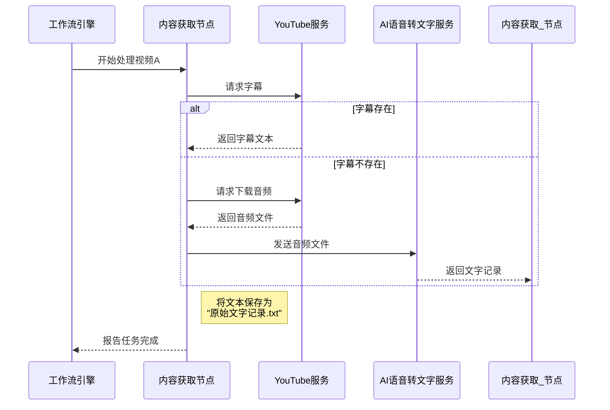

# Chapter 3: 第一阶段：内容获取


在上一章 [BodhiFlow 工作流](02_bodhiflow_工作流_.md) 中，我们了解了 BodhiFlow 的“总装配线蓝图”，它由一系列[流程节点 (Node)](06_流程节点__node__.md) 构成。现在，是时候深入这条流水线的第一个，也是最关键的工段了——**内容获取**。

想象一下，你是一家果汁厂的采购经理。你的任务是去市场上采购各种水果——苹果、橙子、草莓，无论它们是装在箱子里、袋子里还是篮子里。在你把它们送进榨汁车间之前，你必须先完成一项重要工作：把所有水果都清洗干净、去皮、去核，然后切成标准大小的果块。

“内容获取”阶段扮演的正是这样一个“采购与预处理”部门的角色。它负责处理所有前端的“脏活累活”，无论你给它的是一个 YouTube 视频链接、一个播客音频，还是一个本地视频文件，它的最终目标都只有一个：**将这些五花八门的媒体内容，统一转换成标准化的纯文本——“原始文字记录”**。这些文字记录就是后续[第二阶段：内容精炼](04_第二阶段_内容精炼_.md)工序所需要的“标准果块”。

## “内容获取”阶段都做了什么？

这个阶段的核心任务可以分解为一套智能的、自动化的处理流程。让我们以处理一个 YouTube 视频为例，看看它具体做了哪些工作：

1.  **优先寻找“现成字幕”**：最高效的方法，当然是直接使用视频创作者上传的官方字幕。BodhiFlow 会首先尝试从 YouTube 下载现成的、高质量的文字稿。这就像在市场上直接买到了已经切好的水果，省时省力。

2.  **如果没字幕，就“听”出来**：很多视频并没有现成的字幕。这时，BodhiFlow 会启动备用方案：
    *   **下载音频**：它会像一个下载工具一样，只将视频中的音频部分下载到本地。
    *   **语音转文字 (Speech-to-Text, STT)**：然后，它会将这段音频发送给强大的[多供应商AI服务](05_多供应商ai服务_.md)（比如 OpenAI 的 Whisper 模型）。AI 会“听”一遍音频，然后将听到的所有语音内容转换成文字。这就像你雇佣了一位速记员，帮你把会议录音整理成文字稿。

3.  **处理其他来源**：这个流程同样适用于其他类型的内容：
    *   **本地视频/音频文件**：直接提取音频，然后进行语音转文字。
    *   **播客 (Podcast)**：从 RSS 地址找到音频的下载链接，下载后进行语音转文字。

无论来源如何、过程多么复杂，最终的产出物都是格式统一的 `.txt` 文本文件，我们称之为“原始文字记录”。

## 流程中的关键“工人”

这个阶段的工作主要由 `ParallelAcquisitionCoordinatorNode`（并行获取协调节点）这个“车间主任”来调度。它会为你的每一个输入（比如播放列表里的每一个视频）都分配一个独立的任务，并让它们**并行处理**，大大提高了效率。

而每个任务的具体执行，则是由 `process_single_video_acquisition` 这个“全能工人”来完成的。让我们通过简化的代码来看看它是如何工作的。

### 代码一瞥：一个“全能工人”的决策逻辑

`process_single_video_acquisition` 函数位于 `utils/acquisition_processor.py` 文件中，它的逻辑就像一个决策树。

```python
# 文件: utils/acquisition_processor.py

def process_single_video_acquisition(video_data: dict, config: dict) -> dict:
    # 接收视频信息和配置
    source_type = video_data["source_type"]
    raw_text = None

    # 第一步：判断内容来源
    if source_type == "youtube_url":
        # 如果是 YouTube 视频，优先尝试下载现成字幕
        raw_text = download_youtube_transcript(video_data["source_path"])

        # 如果没有字幕，就下载音频，然后用 AI 转成文字
        if raw_text is None:
            # ... 此处省略下载音频和语音转文字的代码 ...
            pass

    elif source_type == "local_file":
        # 如果是本地文件，直接提取音频，用 AI 转成文字
        # ... 此处省略提取音频和语音转文字的代码 ...
        pass

    elif source_type == "podcast_audio":
        # 如果是播客，先下载音频，再用 AI 转成文字
        # ... 此处省略下载播客音频和语音转文字的代码 ...
        pass

    # 最后一步：如果成功获取到文本，就保存它
    if raw_text:
        save_raw_transcript(raw_text, video_data["original_title"], config["intermediate_dir"])
        return {"status": "success", ...} # 返回成功结果
    else:
        return {"status": "failure", ...} # 返回失败结果
```

这段代码清晰地展示了“内容获取”阶段的核心策略：
*   **因地制宜**：根据不同的输入类型（`source_type`）采取不同的处理策略。
*   **优先原则**：对 YouTube 视频，总是优先尝试最简单、成本最低的方法（下载字幕）。
*   **备用方案**：当最优方案行不通时，自动切换到备用方案（语音转文字）。
*   **标准化输出**：无论过程如何，最终都调用 `save_raw_transcript` 将结果保存为标准的文本文件。

## 幕后探秘：流水线如何运转？

当我们只勾选[图形用户界面 (GUI)](01_图形用户界面__gui__.md)上的“第一阶段”并点击“开始处理”时，后台到底发生了什么？我们可以用一个简单的时序图来描绘这个过程。



这个图表直观地展示了 BodhiFlow 的“智能备用方案”机制。它总会先尝试最高效的方法，失败后无缝切换到备用方案，确保能最大程度地成功获取内容。

### 代码深潜：并行处理的力量

你可能注意到了，这个阶段的节点叫做 `ParallelAcquisitionCoordinatorNode`（并行获取协调节点）。“并行”是这里的关键词。如果你的输入是一个包含 20 个视频的播放列表，BodhiFlow 不会一个一个地处理它们，而是会同时启动多个处理进程，就像工厂里同时开放多个预处理台一样。

这是通过 Python 的 `ProcessPoolExecutor` 实现的，让我们看看 `nodes.py` 中被大大简化的 `exec` 方法：

```python
# 文件: nodes.py

# ... 在 ParallelAcquisitionCoordinatorNode 类中 ...
def exec(self, prep_data):
    video_sources = prep_data["video_sources_queue"] # 获取待处理视频列表
    max_workers = prep_data["max_workers_processes"] # 获取并行数量
    config = prep_data["config"] # 获取配置

    # 创建一个进程池，就像雇佣了多个临时工
    with ProcessPoolExecutor(max_workers=max_workers) as executor:
        # 把所有视频处理任务一次性分配给这些临时工
        future_to_video = {
            executor.submit(
                process_single_video_acquisition, video_data, config
            ): video_data
            for video_data in video_sources
        }

        # 等待所有任务完成，并收集结果
        for future in as_completed(future_to_video):
            # ... 此处省略收集和报告结果的代码 ...
            pass
    
    return results # 返回所有处理结果
```
这段代码的核心思想是：
1.  **创建进程池**：`ProcessPoolExecutor` 创建了一个可以同时运行多个任务的“工人池”。
2.  **提交任务**：`executor.submit` 将每一个视频的处理工作（即调用 `process_single_video_acquisition` 函数）作为一个独立的任务提交给进程池。
3.  **并发执行**：进程池会自动调度，让这些任务在你的计算机多核 CPU 上同时运行。

这种并行处理机制，使得 BodhiFlow 在处理大量内容时依然能保持高效。

## 总结

在本章中，我们深入了解了 BodhiFlow 工作流的第一个重要阶段——内容获取。我们学到了：

*   **核心目标**：此阶段的唯一目标是将各种格式的音视频内容，统一转换为标准化的**“原始文字记录”**。
*   **智能策略**：它会优先尝试下载现成的字幕，如果失败，则会自动切换到下载音频并使用 AI 进行语音转文字的备用方案。
*   **广泛的适应性**：无论是 YouTube 视频、播客还是本地文件，它都有一套相应的处理流程。
*   **高效的并行处理**：通过并行计算，它可以同时处理多个内容源，大大缩短了等待时间。

现在，我们已经成功地将各种“原材料”加工成了标准化的“半成品”。这些原始文字记录虽然内容完整，但可能充满了口语化的表达、冗余信息和不连贯的句子。如何将这些粗糙的文字打磨成精美的文章和笔记呢？

这就是我们下一章要探索的魔法。准备好进入精加工车间了吗？让我们前往下一章：[第二阶段：内容精炼](04_第二阶段_内容精炼_.md)。

---

Generated by [AI Codebase Knowledge Builder](https://github.com/The-Pocket/Tutorial-Codebase-Knowledge)