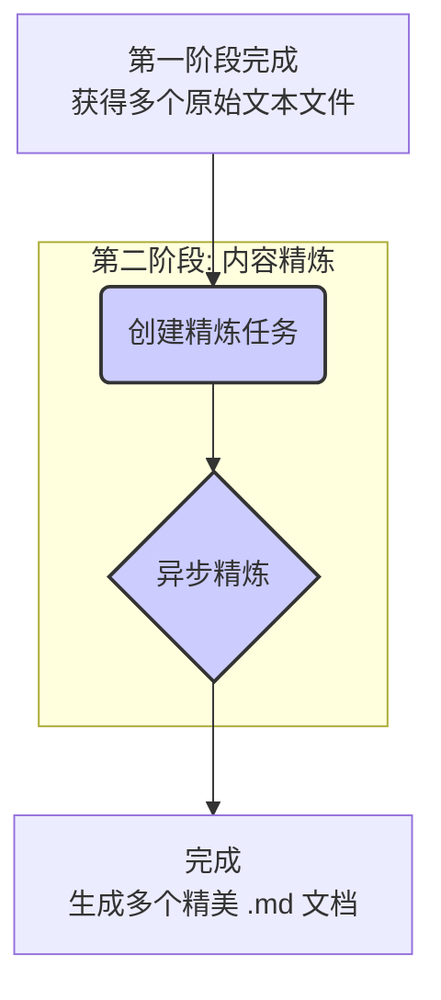
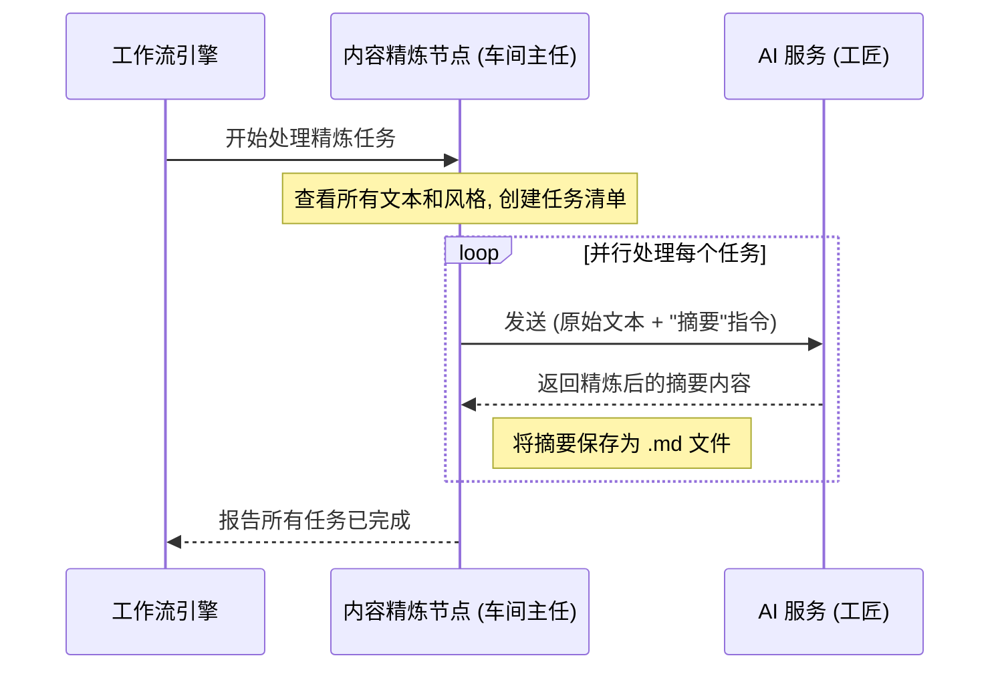

# Chapter 4: 第二阶段：内容精炼


在上一章 [第一阶段：内容获取](03_第一阶段_内容获取_.md) 中，我们成功地扮演了一位采购经理的角色，将各种来源的音视频内容，统一加工成了标准化的“原材料”——原始文字记录 (`.txt` 文件)。但这些记录就像一堆未经雕琢的璞玉，虽然包含了所有信息，却杂乱无章，难以阅读和利用。

如何将这些璞玉雕琢成精美的艺术品？这正是本章要探讨的核心——**内容精炼**。

如果说第一阶段是“获取原材料”，那么第二阶段就是“创意工坊”。在这里，我们将请来一位技艺高超的“工匠”——大型语言模型（LLM），让它根据我们提供的“设计图纸”（Prompts），将粗糙的文字打磨成结构清晰、富有洞见的知识成品。这正是 BodhiFlow 实现“从内容到智慧”转变的关键所在。

## 什么是“内容精炼”？

想象一下，你手上有一份会议的速记稿，里面充满了“嗯”、“啊”这样的口头禅、重复的句子和杂乱的思绪。你希望把它变成：

*   一份简明扼要的**会议纪要**。
*   一个包含所有关键知识点的**学习大纲**。
*   一组用于自我测试的**问答卡片**。

手动完成这些工作费时费力。而“内容精炼”阶段就是利用 AI 自动完成这个过程。它接收第一阶段产出的原始文字，并根据你在[图形用户界面 (GUI)](01_图形用户界面__gui__.md)上选择的“精炼风格”，对内容进行深度加工和再创作。


你在界面上勾选的每一个风格，都相当于给 AI 工匠下达了一条指令，告诉它你想要什么样的成品。

## “创意工坊”里的核心要素

这个创意工坊的运作依赖于两个核心要素：技艺高超的工匠和清晰明确的设计图纸。

### 1. 工匠：大型语言模型 (LLM)

大型语言模型（Large Language Model）是这个阶段的“大脑”和“巧手”。你可以把它想象成一位知识渊博、精通写作的大师。它能够理解语言的细微差别，进行总结、推理、改写和创作。BodhiFlow 通过调用[多供应商AI服务](05_多供应商ai服务_.md)（如 Google Gemini 或 OpenAI 的 GPT 系列）来使用这些强大的模型。

### 2. 设计图纸：提示词 (Prompts)

我们如何告诉这位大师我们想要什么呢？答案是**提示词 (Prompt)**。提示词是一段精心设计的指令文本，它精确地描述了我们希望 AI 完成的任务、遵循的格式和输出的风格。

在 BodhiFlow 中，每一种“精炼风格”都对应着一个独特的提示词模板。这些模板都存放在 `prompts.py` 文件中。

#### 代码一瞥：一张“总结”风格的设计图纸

让我们看看“Summary”（摘要）风格对应的提示词模板是什么样的。

```python
# 文件: prompts.py

text_refinement_prompts = {
    # ... 其他风格的提示词 ...
    "Summary": """Summarize the following transcript into a concise and informative summary.
    ... (省略部分指令)
    All output must be generated entirely in [Language].
    Format the entire response using Markdown syntax.
    Text: """,
    # ... 其他风格的提示词 ...
}
```

这段代码定义了一个名为 `Summary` 的提示词。它告诉 AI：
*   **任务**：将接下来的文字稿总结成一份简洁、信息丰富的摘要。
*   **语言**：必须使用 `[Language]` 指定的语言输出（BodhiFlow 会自动将 `[Language]` 替换为你设定的语言，如“简体中文”）。
*   **格式**：必须使用 Markdown 格式。
*   **输入**：指令末尾的 `Text:` 之后，会附上原始文字记录。

当你选择 `Summary` 风格时，BodhiFlow 就会把这张“设计图纸”和原始文字一起交给 AI，AI 就会严格按照图纸要求，产出你想要的总结。

## 工作流程揭秘

当第一阶段完成后，工作流是如何启动并完成内容精炼的呢？这个过程主要由 `AsyncRefinementCoordinatorNode`（异步精炼协调节点）这个“车间主任”来管理。



这个流程可以分解为以下几个步骤：

1.  **创建任务清单 (`RefinementTaskCreatorNode`)**：首先，BodhiFlow 会查看你有多少份原始文本文件，以及你勾选了多少种精炼风格。然后，它会为“每个文本”和“每种风格”的组合都创建一个独立的任务。例如，如果你有 2 份文本，选择了 3 种风格，它就会创建 2 * 3 = 6 个精炼任务。

2.  **并行发送任务 (`AsyncRefinementCoordinatorNode`)**：接着，它会像一个高效的调度员，**同时**将这些任务分发给 AI 服务。这种异步并行的处理方式，意味着你不需要等待一个任务完成后再开始下一个，极大地提升了处理速度。

3.  **接收并保存结果**：当 AI 完成一个任务后，BodhiFlow 会接收返回的精炼内容，并将其保存为一个格式精美的 Markdown (`.md`) 文件。文件名通常会包含原始标题和所用风格，例如 `Python基础教程 [摘要].md`。

### 内部运作时序图

让我们用一个时序图来更直观地展示这个过程。


这个图清晰地展示了“内容精炼节点”是如何与 AI 服务高效协作，并行完成所有加工任务的。

## 代码深潜

现在，让我们深入代码，看看这个魔法是如何具体实现的。

### 1. 创建精炼任务

`RefinementTaskCreatorNode` 节点负责排列组合，生成所有待办任务。其核心逻辑可以在 `utils/llm_refiner.py` 的 `create_refinement_tasks` 函数中找到。

```python
# 文件: utils/llm_refiner.py

def create_refinement_tasks(transcript_files, styles_data, output_dir):
    tasks = []
    for transcript_file in transcript_files:
        # 从文件名 "标题_raw_transcript.txt" 中提取标题
        video_title = Path(transcript_file).stem.replace("_raw_transcript", "")

        for style_name, style_prompt_template in styles_data:
            # 为每个文本和风格的组合创建一个任务
            task = {
                "transcript_file": transcript_file,
                "style_name": style_name,
                "style_prompt": style_prompt_template,
                "video_title": video_title,
                # ... 其他信息，如输出文件路径 ...
            }
            tasks.append(task)
    return tasks
```
这段代码非常直观：它通过两层循环，遍历了所有的文本文件和所有的风格，为每一个组合创建了一个包含所有必要信息（如输入文件、风格名称、提示词模板、输出路径等）的任务字典。

### 2. 调用 AI 进行精炼

`AsyncRefinementCoordinatorNode` 节点接收到任务清单后，会调用 `async_refine_single_task` 函数来处理每一个任务。这个函数的核心是调用 AI。

```python
# 文件: utils/llm_refiner.py

async def async_refine_single_task(task: dict, config: dict) -> dict:
    try:
        # 从文件加载原始文本
        raw_text = load_raw_transcript(task["transcript_file"])
        
        # 调用 AI 进行精炼
        refined_text = refine_text_with_llm(
            raw_text,
            task["style_prompt"],
            config["language"],
            # ... 其他AI模型配置 ...
        )

        # ... 此处省略保存文件的代码 ...
        return {"status": "success", ...}

    except Exception as e:
        return {"status": "failure", "error": str(e)}
```
这个函数做了三件事：
1.  读取任务对应的原始文本文件。
2.  调用 `refine_text_with_llm` 函数，将原始文本、提示词模板和目标语言等信息打包，发送给 AI。
3.  等待 AI 返回结果，并准备将其保存。

这里的 `refine_text_with_llm` 函数是真正与 AI 服务对话的地方，它封装了所有底层的 API 调用细节。我们将在下一章 [多供应商AI服务](05_多供应商ai服务_.md) 中更详细地了解它。

## 总结

在本章中，我们深入探索了 BodhiFlow 工作流中充满创造力的“第二阶段：内容精炼”。我们学到了：

*   **核心目标**：此阶段的目标是利用大型语言模型（LLM）的强大能力，将第一阶段产出的原始文字记录，转换为结构化、有价值的知识成品。
*   **两大要素**：这个过程依赖于**AI 工匠 (LLM)** 和**设计图纸 (Prompts)**。我们在 GUI 中选择的“精炼风格”就是为 AI 指定不同的设计图纸。
*   **自动化流程**：BodhiFlow 会自动为每个文本和每种风格创建任务，并以高效的并行方式将它们发送给 AI 处理，最后将结果保存为 `.md` 文件。
*   **代码实现**：我们通过 `prompts.py` 理解了“设计图纸”的构成，并通过 `utils/llm_refiner.py` 窥见了任务创建和 AI 调用的核心逻辑。

现在，我们不仅有了“原材料”，还掌握了将其加工成各种“精美成品”的方法。你可能已经注意到，我们多次提到了“AI 服务”，比如 Gemini 或 OpenAI。BodhiFlow 的强大之处在于它不依赖于任何单一的 AI 提供商。它是如何做到这一点的呢？

准备好了解 BodhiFlow 的“军火库”了吗？让我们进入下一章：[多供应商AI服务](05_多供应商ai服务_.md)。

---

Generated by [AI Codebase Knowledge Builder](https://github.com/The-Pocket/Tutorial-Codebase-Knowledge)