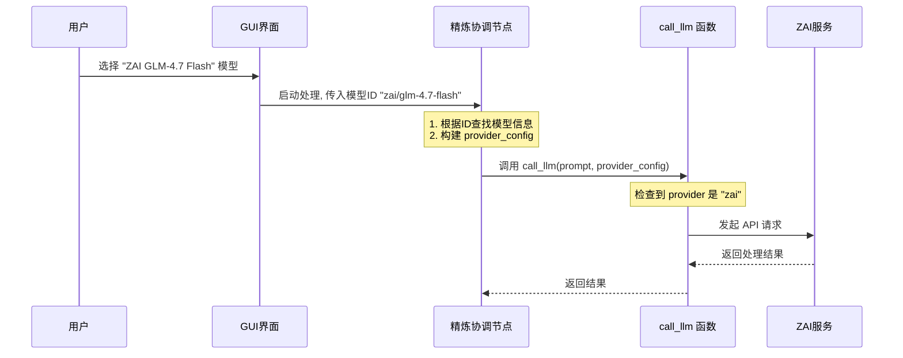

# Chapter 5: 多供应商AI服务


在上一章 [第二阶段：内容精炼](04_第二阶段_内容精炼_.md) 中，我们见证了 BodhiFlow 如何像一位魔法师一样，将平淡的原始文字变成结构精美的智慧文档。我们知道，这位魔法师的魔力来自于强大的“AI 工匠”——大型语言模型（LLM）。

但你可能已经想到了一个问题：如果这位我们依赖的“AI 工匠”（比如 Google Gemini）突然“罢工”了（服务中断），或者另一位更厉害、更便宜的工匠（比如 OpenAI 或 ZAI 的新模型）出现了，我们该怎么办？难道要重写整个应用的“魔法咒语”（代码）吗？

当然不用！这正是 BodhiFlow 最核心、最优雅的设计哲学之一——**多供应商 AI 服务**。

## 什么是多供应商AI服务？

想象一下，你的智能手机用的是 USB-C 充电口。这是一个**通用标准接口**。你可以用华为的充电器给它充电，也可以用小米的，甚至苹果的。你不需要为每个品牌的充电器都换一部手机。你只需要确保充电器是 USB-C 接口的就行。

BodhiFlow 的“多供应商 AI 服务”设计就像这个 USB-C 接口。它为所有需要 AI 能力的任务（无论是语音转文字，还是文本精炼）都定义了一个标准化的“插座”。而 OpenAI、ZAI、Gemini 这些不同的 AI 提供商，就像是不同品牌的“充电器”。


这意味着，你可以通过简单的配置，随时在这些服务之间无缝切换，而**无需修改任何一行核心代码**。这种设计带来了巨大的好处：

*   **灵活性**：你可以根据成本、效果或可用性，自由选择最适合你当前任务的 AI 模型。
*   **可靠性**：当某个提供商的服务出现问题时，你可以轻松切换到另一个，保证工作不中断。
*   **面向未来**：当未来出现更强大的新技术时，我们只需为它开发一个新的“适配器”，就能轻松接入 BodhiFlow 系统。

## 幕后英雄：配置文件和“调度中心”

这种“即插即用”的魔法是如何实现的呢？主要依赖两个关键部分：一份“AI 服务目录”和一个智能的“调度中心”。

### 1. AI 服务目录 (`models_config.json`)

BodhiFlow 的所有“已知”的 AI 模型都定义在一个配置文件中。虽然你通常不需要直接编辑这个文件，但了解它的结构有助于你理解其工作原理。系统内部会加载这个配置，就像一本服务目录。

让我们看看 `utils/models_config.py` 文件中定义的默认配置，它展示了这本目录的样子：

```python
# 文件: utils/models_config.py (简化版)

# 默认的第二阶段（精炼）模型列表
_DEFAULT_PHASE2_MODELS = [
    { "id": "zai/glm-4.7-flash", "label": "ZAI GLM-4.7 Flash", "provider": "zai", ... },
    { "id": "gemini/gemini-2.5-flash", "label": "Gemini 2.5 Flash", "provider": "gemini", ... },
    { "id": "deepseek/deepseek-v3.2", "label": "DeepSeek V3.2", "provider": "deepseek", ... },
    { "id": "openai/gpt-5-mini", "label": "OpenAI gpt-5-mini", "provider": "openai", ... }
]
```
这段代码就像一本通讯录。每一项都代表一个可用的 AI 模型，其中最重要的信息是 `provider` 字段。它明确地告诉 BodhiFlow，这个模型属于哪个“供应商”（`zai`、`gemini`、`openai` 等）。你在 GUI 界面上看到的模型下拉列表，就是根据这份目录生成的。

### 2. 智能调度中心 (`call_llm` 函数)

当 BodhiFlow 需要使用 AI 时，它不会直接给某个特定的供应商（比如 Google）打电话。相反，它会把任务交给一个名为 `call_llm` 的“智能调度中心”。这个调度中心位于 `utils/call_llm.py` 文件中，它的工作就是查看任务单上的 `provider` 信息，然后将电话转接到正确的供应商那里。

让我们看看 `call_llm` 函数被极度简化的样子：

```python
# 文件: utils/call_llm.py (简化版)

def call_llm(prompt: str, provider_config: dict) -> str:
    # 从配置中获取供应商信息
    provider = provider_config.get("provider")
    model = provider_config.get("model_name")
    key = provider_config.get("api_key")

    # 根据供应商，调用不同的内部函数
    if provider == "gemini":
        return _call_gemini(prompt, model, key) # 转接给 Gemini
    if provider == "openai":
        return _call_openai(prompt, model, key) # 转接给 OpenAI
    if provider == "zai":
        return _call_zai(prompt, model, key)    # 转接给 ZAI
    # ... 其他供应商 ...
```
这个函数就像一个总机接线员。它接收任务（`prompt`）和一个包含所有供应商信息的配置包（`provider_config`），然后通过一个简单的 `if` 判断，将请求转发给真正负责与该供应商 API 对话的内部函数（如 `_call_gemini`）。

## 完整的调用流程

现在，让我们把所有环节串联起来，看看当你点击“开始处理”后，一次典型的 AI 调用是如何发生的。



这个流程清晰地展示了 BodhiFlow 的解耦设计。`工作流节点` 本身并不关心最终是哪个 AI 提供了服务，它只负责准备好标准的 `provider_config`，然后把它交给 `call_llm` 这个专业的“调度中心”去处理。

### 代码深潜：`provider_config` 的诞生

你可能会好奇，`工作流节点` 是如何创建出 `provider_config` 这个关键的配置包的？让我们看看 `core/nodes.py` 中 `AsyncRefinementCoordinatorNode` 的 `prep` 方法的简化版：

```python
# 文件: core/nodes.py (AsyncRefinementCoordinatorNode.prep 方法简化版)

def prep(self, shared):
    # 1. 从共享数据中获取用户选择的模型ID
    phase2_model_id = shared.get("phase2_model_id")

    # 2. 从“服务目录”中查找该ID对应的完整信息
    phase2_entry = get_model_by_id(phase2_model_id, "phase2")

    # 3. 提取供应商、模型名和对应的API密钥
    prov = phase2_entry.get("provider")
    key = shared.get(f"{prov}_api_key") # 例如, 获取 zai_api_key

    # 4. 打包成 provider_config
    provider_config = {
        "provider": prov,
        "model_name": phase2_entry.get("model_name"),
        "api_key": key,
    }
    # ... 返回包含这个配置包的数据 ...
```

这段代码揭示了“连接”的过程：
1.  它从用户在 GUI 的选择中拿到一个唯一的 `phase2_model_id`。
2.  使用这个 ID 去“服务目录” (`models_config`) 中查询，找到对应的 `provider`。
3.  根据 `provider` 的名字，再去获取用户输入的相应 API 密钥。
4.  最后，将所有这些信息打包成一个标准的 `provider_config` 字典，供 `call_llm` 函数使用。

## 不仅仅是文本精炼

这个强大的多供应商设计模式是 BodhiFlow 的基石，它不仅用在第二阶段的文本精炼（LLM），也同样用在了第一阶段的语音转文字（ASR）上。

例如，在 `utils/speech_to_text.py` 文件中，有一个 `transcribe_audio_chunks` 函数，它也遵循着完全相同的逻辑：

```python
# 文件: utils/speech_to_text.py (简化版)

def transcribe_audio_chunks(chunk_paths: list, asr_config: dict) -> str:
    # 同样地，从配置中获取供应商信息
    provider = asr_config.get("provider")

    if provider == "zai":
        # ... 调用 ZAI 的语音转文字服务 ...
    else:
        # 默认或指定为 openai 时，调用 OpenAI 的服务
        # ... 调用 OpenAI 的语音转文字服务 ...
```

这证明了该设计的通用性和可扩展性。

## 总结

在本章中，我们揭开了 BodhiFlow 灵活性的秘密——多供应商 AI 服务。我们学到了：

*   **核心思想**：通过一个像“USB-C”一样的标准接口，BodhiFlow 实现了与不同 AI 服务提供商的解耦，避免了“供应商锁定”。
*   **两大组件**：这个系统依赖于一份“AI 服务目录” (`models_config.json`) 来定义可用的模型，以及一个“智能调度中心” (`call_llm` 函数) 来根据配置将任务分发给正确的供应商。
*   **工作流程**：从用户在 GUI 上的选择开始，系统一步步构建出标准的 `provider_config`，最终由调度函数完成对具体 AI 服务的调用。
*   **通用设计**：这种强大的设计模式被一致地应用在语音转文字（ASR）和文本精炼（LLM）等所有需要 AI 能力的环节。

现在你已经理解了 BodhiFlow 的整体工作流，以及它如何灵活地与外部 AI 服务进行交互。那么，构成整个工作流的那些独立的“车间”——流程节点（Node），它们自己又是如何设计和工作的呢？

准备好深入了解 BodhiFlow 的基本构建单元了吗？让我们进入下一章：[流程节点 (Node)](06_流程节点__node__.md)。

---

Generated by [AI Codebase Knowledge Builder](https://github.com/The-Pocket/Tutorial-Codebase-Knowledge)