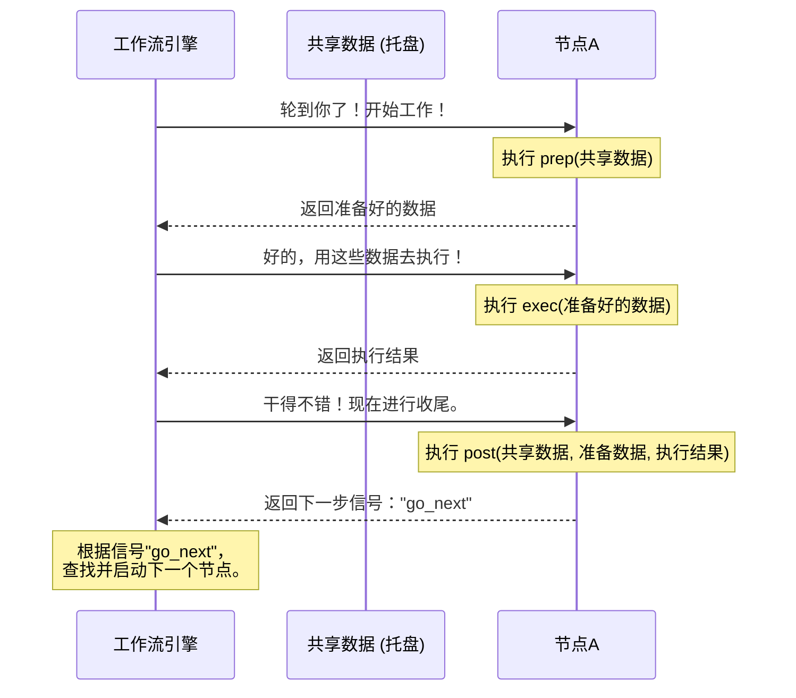

# Chapter 6: 流程节点 (Node)


在上一章 [多供应商AI服务](05_多供应商ai服务_.md) 中，我们探索了 BodhiFlow 如何像一个拥有通用充电口的设备一样，灵活地接入来自不同供应商的 AI 能力。我们知道了 BodhiFlow 有一个智能“调度中心”，可以根据我们的选择，将任务分发给最合适的“AI工匠”。

现在，让我们把视线从外部的“供应商”收回到 BodhiFlow 内部的“工厂车间”。我们已经知道，整个处理过程是一条由[BodhiFlow 工作流](02_bodhiflow_工作流_.md)定义的“总装配线”。那么，这条装配线上的每一个独立的“机器人工作站”又是如何工作的呢？这些工作站，就是我们本章的主角——**流程节点 (Node)**。

## 什么是流程节点？

**流程节点**是构成工作流的最小、最独立的**处理单元**。

回到我们的汽车制造厂比喻。整个工厂是一条庞大的装配线（工作流），而这条线上负责安装轮胎的机器人、负责喷漆的机械臂、负责拧螺丝的设备，每一个都是一个独立的“节点”。


每个节点都具备以下特点：
*   **职责单一**：一个节点只做一件具体的事。例如，“输入扩展节点”只负责解析用户输入，“内容获取节点”只负责下载和转录。这使得系统逻辑清晰，易于维护。
*   **标准化的工作流程**：每个节点都遵循一套相同的工作节拍——“准备、执行、收尾”。这保证了它们可以被工作流引擎统一调度。
*   **可插拔**：就像乐高积木一样，每个节点都是一个独立的模块。我们可以轻松地将它们连接起来，构建出各种各样的工作流。

在 BodhiFlow 中，所有的节点都定义在 `nodes.py` 文件里，它们是整个应用逻辑的核心构建块。

## 一个节点的生命周期：“准备-执行-收尾”

每个节点就像一个训练有素的工人，严格按照“三步曲”来完成自己的任务。这三个步骤分别对应节点类中的三个核心方法：`prep()`、`exec()` 和 `post()`。

让我们想象一个负责“制作果汁”的节点：

```mermaid
graph TD
    A[上游节点<br/>(提供水果)] --> B{制作果汁节点};
    B --> C[下游节点<br/>(接收果汁)];

    subgraph "制作果汁节点内部"
        D(1. 准备 `prep`)
        E(2. 执行 `exec`)
        F(3. 收尾 `post`)
    end

    D --> E --> F;

    style B fill:#f9f,stroke:#333,stroke-width:2px
```

1.  **`prep()` - 准备阶段**
    *   **目标**：从传送带上拿取所需原材料。
    *   **比喻**：工人在开始榨汁前，先从一个共享的“工作托盘”（`shared` 数据对象）上拿起需要的水果、糖和水。它把自己需要的所有东西都准备好，放在自己的工作台上。

2.  **`exec()` - 执行阶段**
    *   **目标**：完成核心工作。
    *   **比喻**：工人启动榨汁机，将准备好的水果榨成果汁。这是最耗时、最核心的一步。**重要的是，这个阶段不应该去动那个共享的“工作托盘”，只专注于处理自己手头的工作。**

3.  **`post()` - 收尾阶段**
    *   **目标**：将产出物放回传送带，并决定下一步去哪里。
    *   **比喻**：工人将榨好的果汁打包好，放回到共享的“工作托盘”上。然后，他查看工作指令，如果成功榨出了果汁，他就按下一个按钮，让传送带把托盘送到“包装车间”；如果水果是坏的，他就按另一个按钮，送到“废料处理站”。这个“决定”就是 `post` 方法的返回值，它告诉工作流引擎接下来应该激活哪个节点。

### 代码一瞥：一个节点的标准结构

让我们来看一个极度简化的节点代码，它清晰地展示了这“三步曲”结构。

```python
# 文件: nodes.py (简化示例)

from pocketflow import Node

class MySimpleNode(Node):
    
    def prep(self, shared_data):
        # 1. 准备：从共享数据中获取所需信息
        my_input = shared_data.get("some_key")
        return {"input_for_exec": my_input}

    def exec(self, prep_data):
        # 2. 执行：处理数据并返回结果
        #    只使用 prep 阶段准备好的数据
        result = prep_data["input_for_exec"].upper() # 例如，转为大写
        return result

    def post(self, shared_data, prep_res, exec_res):
        # 3. 收尾：将结果存入共享数据，并决定下一步
        shared_data["new_key"] = exec_res
        
        if exec_res:
            return "go_to_next_node" # 返回下一步的“信号”
        else:
            return "go_to_error_node"
```
这个简单的例子完美地诠释了节点的生命周期：
*   `prep` 从共享数据 `shared_data` 中读取信息。
*   `exec` 接收 `prep` 的返回值，进行处理。
*   `post` 将 `exec` 的结果写回 `shared_data`，并返回一个字符串“信号”，告诉工作流引擎下一步该怎么走。

## 工作流引擎如何与节点协作？

现在我们知道了单个节点的内部运作方式，那么工作流引擎（Flow Engine）是如何调度它的呢？

我们可以用一个简单的时序图来描绘这个过程：



这个流程的核心在于**职责分离**：
*   **工作流引擎**是“调度员”，它不关心节点具体做了什么，只负责按顺序调用节点的 `prep`、`exec`、`post` 方法，并根据 `post` 返回的信号，决定下一个要调度的节点。
*   **节点**是“工人”，它不关心自己从哪里来、要到哪里去，只专注于完成自己的“准备-执行-收尾”三步曲。
*   **共享数据**是“托盘”，在节点之间安静地传递着工作成果。

## 实例剖析：`TempFileCleanupNode`

让我们来看一个 BodhiFlow 中真实但非常简单的节点：`TempFileCleanupNode`（临时文件清理节点）。它的任务非常单纯：删除处理过程中产生的临时文件夹。

### 代码深潜

以下是 `nodes.py` 中 `TempFileCleanupNode` 的简化版代码：

```python
# 文件: nodes.py (TempFileCleanupNode 简化版)
import shutil
from pathlib import Path
from pocketflow import Node

class TempFileCleanupNode(Node):
    
    def prep(self, shared):
        # 1. 准备：获取临时文件夹的路径
        return {"temp_dir": shared["temp_dir"]}

    def exec(self, prep_data):
        # 2. 执行：删除那个文件夹
        temp_dir = prep_data["temp_dir"]
        if Path(temp_dir).exists():
            shutil.rmtree(temp_dir)
            print("临时文件已清理")
        return "cleanup_complete"

    def post(self, shared, prep_res, exec_res):
        # 3. 收尾：直接告诉引擎下一步该做什么
        return "cleanup_complete"
```
这个节点的逻辑非常清晰：
1.  **`prep`**: 从共享数据 `shared` 中拿到 `temp_dir` 的路径。
2.  **`exec`**: 使用 Python 的 `shutil.rmtree` 函数，毫不留情地删除该路径对应的文件夹。
3.  **`post`**: 无论 `exec` 做了什么，它都返回一个固定的信号 `"cleanup_complete"`。在 `flow.py` 的蓝图中，这个信号会触发下一个节点，通常是 `FlowCompletionNode`（流程完成节点）。

这个例子完美地展示了一个理想节点的特性：目标明确、逻辑简单、与系统的其他部分高度解耦。

## 总结

在本章中，我们深入了解了构成 BodhiFlow 工作流的基本单元——流程节点 (Node)。我们学到了：

*   **核心概念**：节点是独立的、职责单一的处理单元，就像装配线上的机器人工作站。
*   **生命周期**：每个节点都遵循严格的“准备-执行-收尾”三步曲，分别对应 `prep()`、`exec()` 和 `post()` 三个方法。
*   **协作模式**：工作流引擎负责调度节点，节点负责执行具体任务，而共享数据对象则在它们之间传递信息。
*   **路由机制**：节点的 `post()` 方法通过返回一个“信号”字符串，来告诉工作流引擎接下来应该激活哪个节点，从而实现了流程的动态路由。

通过理解节点的概念，你就掌握了 BodhiFlow 的核心构建逻辑。整个应用程序的复杂功能，都被拆解成了这样一个个简单、清晰、可管理的节点，并通过工作流将它们有机地组织起来。

我们已经了解了节点的通用结构。在 BodhiFlow 中，第一个被执行的节点通常是 `InputExpansionNode`，它负责理解用户的各种输入。它是如何将一个简单的 URL 或文件路径，转换成标准化的处理任务的呢？

准备好了解 BodhiFlow 的“前门接待员”了吗？让我们进入下一章：[输入源处理器](07_输入源处理器_.md)。

---

Generated by [AI Codebase Knowledge Builder](https://github.com/The-Pocket/Tutorial-Codebase-Knowledge)