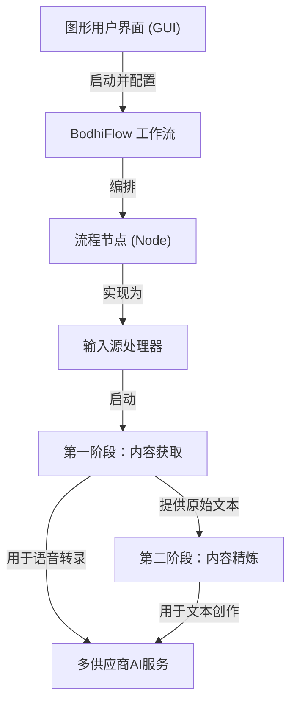

# Tutorial: BodhiFlow

BodhiFlow 是一个能将各种*原始内容*（例如YouTube视频、播客或本地文件）自动转换成**结构化智慧文档**的强大工具。
它通过一个两阶段的*流水线*，首先获取并转录内容的原始文字，然后利用多种AI大模型，根据你的需求将文字精炼成总结、纪要或学习笔记等多种格式。所有这一切都可以通过一个直观的图形界面轻松完成。

**Source Repository:** [None](None)

## Chapters

1. [图形用户界面 (GUI)
](01_图形用户界面__gui__.md)
2. [BodhiFlow 工作流
](02_bodhiflow_工作流_.md)
3. [第一阶段：内容获取
](03_第一阶段_内容获取_.md)
4. [第二阶段：内容精炼
](04_第二阶段_内容精炼_.md)
5. [多供应商AI服务
](05_多供应商ai服务_.md)
6. [流程节点 (Node)
](06_流程节点__node__.md)
7. [输入源处理器
](07_输入源处理器_.md)

---

Generated by [AI Codebase Knowledge Builder](https://github.com/The-Pocket/Tutorial-Codebase-Knowledge)